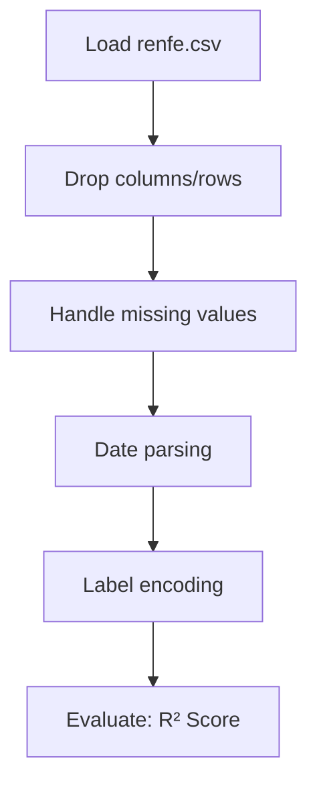

# Bayesian Statistics Python_PyMC3_ArviZ

## 1. Project Overview

This project implements a **Exploratory Data Analysis** pipeline for **Bayesian Statistics Python_PyMC3_ArviZ**.

| Property | Value |
|----------|-------|
| **ML Task** | Exploratory Data Analysis |
| **Dataset Status** | OK LOCAL |

## 2. Dataset

**Data sources detected in code:**

- `renfe.csv`

**Files in project directory:**

- `renfe_small.csv`

**Standardized data path:** `data/bayesian_statistics_python_pymc3_arviz/`

## 3. Pipeline Overview

### Original Notebook Pipeline

**Preprocessing:**
- Drop columns/rows
- Handle missing values (fillna)
- Date parsing
- Label encoding (LabelEncoder)

**Evaluation metrics:**
- R² Score

## 4. ML Workflow



## 5. Notebook Summary

| Metric | Value |
|--------|-------|
| Total cells | 65 |
| Code cells | 36 |
| Markdown cells | 29 |

## 6. Model Details

### Evaluation Metrics

- R² Score

No model training in this project.

## 7. Project Structure

```
Bayesian Statistics Python_PyMC3_ArviZ/
├── Bayesian Statistics Python_PyMC3_ArviZ.ipynb
├── renfe_small.csv
└── README.md
```

## 8. Setup & Installation

`pip install -r requirements.txt` from the workspace root.

**Key dependencies:**

- `matplotlib`
- `numpy`
- `pandas`
- `scikit-learn`
- `scipy`
- `seaborn`

## 9. How to Run

Open and run the notebook(s) sequentially:

```bash
jupyter notebook
```

- Open `Bayesian Statistics Python_PyMC3_ArviZ.ipynb` and run all cells

## 10. Testing

Automated tests are available in `tests/test_p105_*.py`:

```bash
python -m pytest tests/test_p105_*.py -v
```

Tests validate data loading and library imports.

## 11. Limitations

- No model training — this is an analysis/tutorial notebook only
