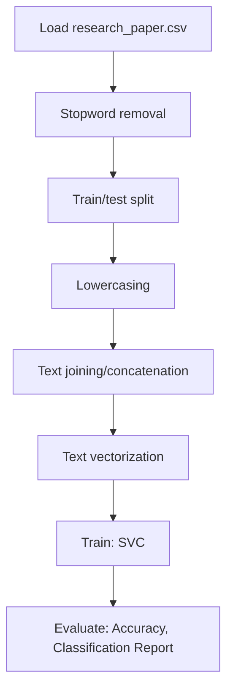

# (Conceptual) machine learning spaCy

## 1. Project Overview

This project implements a **Classification** pipeline for **(Conceptual) machine learning spaCy**.

| Property | Value |
|----------|-------|
| **ML Task** | Classification |
| **Dataset Status** | OK LOCAL |

## 2. Dataset

**Data sources detected in code:**

- `research_paper.csv`

**Files in project directory:**

- `research_paper.csv`

**Standardized data path:** `data/conceptual_machine_learning_spacy/`

## 3. Pipeline Overview

### Original Notebook Pipeline

**Preprocessing:**
- Stopword removal
- Train/test split
- Lowercasing
- Text joining/concatenation
- Text vectorization (CountVectorizer)

**Models trained:**
- SVC

**Evaluation metrics:**
- Accuracy
- Classification Report

## 4. ML Workflow



## 5. Notebook Summary

| Metric | Value |
|--------|-------|
| Total cells | 19 |
| Code cells | 19 |
| Markdown cells | 0 |
| Original models | SVC |

## 6. Model Details

### Original Models

- `SVC`

### Evaluation Metrics

- Accuracy
- Classification Report

## 7. Project Structure

```
(Conceptual) machine learning spaCy/
├── machine learning spaCy.ipynb
├── research_paper.csv
└── README.md
```

## 8. Setup & Installation

`pip install -r requirements.txt` from the workspace root.

**Key dependencies:**

- `matplotlib`
- `nltk`
- `numpy`
- `pandas`
- `scikit-learn`
- `seaborn`
- `spacy`

## 9. How to Run

Open and run the notebook(s) sequentially:

```bash
jupyter notebook
```

- Open `machine learning spaCy.ipynb` and run all cells

## 10. Testing

Automated tests are available in `tests/test_p108_*.py`:

```bash
python -m pytest tests/test_p108_*.py -v
```

Tests validate data loading and model instantiation.

## 11. Limitations

No significant limitations detected.
