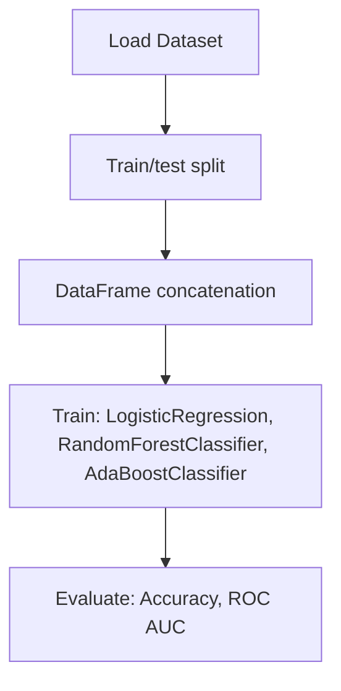

# (Conceptual Analysis) Select Right Threhold Value using ROC curve

## 1. Project Overview

This project implements a **Classification** pipeline for **(Conceptual Analysis) Select Right Threhold Value using ROC curve**.

| Property | Value |
|----------|-------|
| **ML Task** | Classification |
| **Dataset Status** | OK BUILTIN |

## 2. Dataset

## 3. Pipeline Overview

### Original Notebook Pipeline

**Preprocessing:**
- Train/test split
- DataFrame concatenation

**Models trained:**
- LogisticRegression
- RandomForestClassifier
- AdaBoostClassifier
- KNeighborsClassifier

**Evaluation metrics:**
- Accuracy
- ROC AUC

## 4. ML Workflow



## 5. Notebook Summary

| Metric | Value |
|--------|-------|
| Total cells | 27 |
| Code cells | 21 |
| Markdown cells | 6 |
| Original models | LogisticRegression, RandomForestClassifier, AdaBoostClassifier, KNeighborsClassifier |

## 6. Model Details

### Original Models

- `LogisticRegression`
- `RandomForestClassifier`
- `AdaBoostClassifier`
- `KNeighborsClassifier`

### Evaluation Metrics

- Accuracy
- ROC AUC

## 7. Project Structure

```
(Conceptual Analysis) Select Right Threhold Value using ROC curve/
├── Select The RIght Threshold values using ROC curve.ipynb
└── README.md
```

## 8. Setup & Installation

`pip install -r requirements.txt` from the workspace root.

**Key dependencies:**

- `matplotlib`
- `numpy`
- `pandas`
- `scikit-learn`
- `seaborn`

## 9. How to Run

Open and run the notebook(s) sequentially:

```bash
jupyter notebook
```

- Open `Select The RIght Threshold values using ROC curve.ipynb` and run all cells

## 10. Testing

Automated tests are available in `tests/test_p033_*.py`:

```bash
python -m pytest tests/test_p033_*.py -v
```

Tests validate data loading and model instantiation.

## 11. Limitations

No significant limitations detected.
