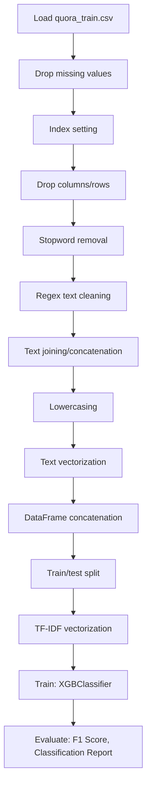

# (Conceptual) Xgboost_bow_tfidf

## 1. Project Overview

This project implements a **Classification** pipeline for **(Conceptual) Xgboost_bow_tfidf**.

| Property | Value |
|----------|-------|
| **ML Task** | Classification |
| **Dataset Status** | OK LOCAL |

## 2. Dataset

**Data sources detected in code:**

- `quora_train.csv`

**Files in project directory:**

- `train.csv`

**Standardized data path:** `data/conceptual_xgboost_bow_tfidf/`

## 3. Pipeline Overview

### Original Notebook Pipeline

**Preprocessing:**
- Drop missing values (dropna)
- Index setting
- Drop columns/rows
- Stopword removal
- Regex text cleaning
- Text joining/concatenation
- Lowercasing
- Text vectorization (CountVectorizer)
- DataFrame concatenation
- Train/test split
- TF-IDF vectorization

**Models trained:**
- XGBClassifier

**Evaluation metrics:**
- F1 Score
- Classification Report

## 4. ML Workflow



## 5. Notebook Summary

| Metric | Value |
|--------|-------|
| Total cells | 20 |
| Code cells | 16 |
| Markdown cells | 4 |
| Original models | XGBClassifier |

## 6. Model Details

### Original Models

- `XGBClassifier`

### Evaluation Metrics

- F1 Score
- Classification Report

## 7. Project Structure

```
(Conceptual) Xgboost_bow_tfidf/
├── Xgboost_bow_tfidf.ipynb
├── train.csv
└── README.md
```

## 8. Setup & Installation

`pip install -r requirements.txt` from the workspace root.

**Key dependencies:**

- `matplotlib`
- `nltk`
- `numpy`
- `pandas`
- `scikit-learn`
- `scipy`
- `seaborn`
- `xgboost`

## 9. How to Run

Open and run the notebook(s) sequentially:

```bash
jupyter notebook
```

- Open `Xgboost_bow_tfidf.ipynb` and run all cells

## 10. Testing

Automated tests are available in `tests/test_p131_*.py`:

```bash
python -m pytest tests/test_p131_*.py -v
```

Tests validate data loading and model instantiation.

## 11. Limitations

No significant limitations detected.
