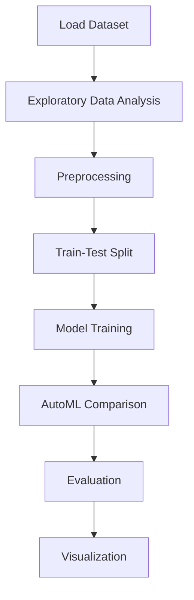

# Airbnb Data Analysis


## Project Overview

**Airbnb Data Analysis** is a **Regression** project in the **Data Analysis** category.

> The code calculates the Kendall correlation matrix (corr) for the 'airbnb' dataset using the corr method, and then creates a heatmap visualization using seaborn (sns.heatmap) with correlation values annotated. The plt.figure(figsize=(15,8)) statement sets the size of the figure. Lastly, the column names of the 'airbnb' dataset are displayed.

**Target variable:** `price`
**Models:** LazyClassifier, LinearRegression, LogisticRegression, PyCaret

## Dataset

| Property | Value |
|----------|-------|
| Type | Tabular |
| Source | Local |
| Path | `data/airbnb_data_analysis/data.csv` |
| Target | `price` |

```python
from core.data_loader import load_dataset
df = load_dataset('airbnb_data_analysis')
```

## Pipeline Files

| File | Lines |
|------|-------|
| `pipeline.py` | 302 |
| `train.py` | 217 |
| `evaluate.py` | 217 |
| `code.ipynb` | 39 code / 43 markdown cells |
| `test_airbnb_data_analysis.py` | test suite |

## ML Workflow



## Core Logic

### Preprocessing

- Missing value imputation
- Train-test split

### Visualizations

- Correlation heatmap
- Count plots
- Box plots
- Scatter plots
- Confusion matrix
- Word cloud

### Helper Functions

- `Encode()`

## Models

| Model | Type |
|-------|------|
| LazyClassifier | AutoML Benchmark (30+ classifiers) |
| LinearRegression | Linear Regressor |
| LogisticRegression | Linear Classifier |
| PyCaret | AutoML Framework |

AutoML is toggled via the `USE_AUTOML` flag in pipeline scripts.
**LazyPredict** (`LazyClassifier`) benchmarks 30+ models automatically.
**PyCaret** `compare_models()` runs cross-validated comparison.

## Reproducibility

```python
random.seed(42); np.random.seed(42); os.environ['PYTHONHASHSEED'] = '42'
```

```bash
python pipeline.py --seed 123    # custom seed
python pipeline.py --reproduce   # locked seed=42
```

## Project Structure

```
Data Analysis/Airbnb Data Analysis/
  Airbnb Data Analysis.pdf
  README.md
  code.ipynb
  data.csv
  evaluate.py
  guideline.txt
  pipeline.py
  test_airbnb_data_analysis.py
  train.py
```

## How to Run

```bash
cd "Data Analysis/Airbnb Data Analysis"
python pipeline.py
python train.py       # training only
python evaluate.py    # evaluation only
```

## Testing

```bash
pytest "Data Analysis/Airbnb Data Analysis/test_airbnb_data_analysis.py" -v
```

## Setup

```bash
pip install lazypredict matplotlib numpy pandas pycaret scikit-learn seaborn wordcloud
```

---
*README auto-generated from `code.ipynb` analysis.*