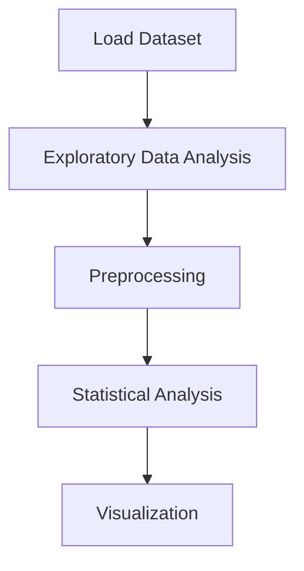

# COVID-19 Global Data Analysis


## Project Overview

**COVID-19 Global Data Analysis** is a **Exploratory Data Analysis** project in the **Data Analysis** category.

> 2.4. [Italy (The Early Chaos)](#head-2-4)


## Dataset

| Property | Value |
|----------|-------|
| Type | Tabular |
| Source | Local |
| Path | `data/covid19_global_analysis/worldometer_coronavirus_daily_data.csv` |

```python
from core.data_loader import load_dataset
df = load_dataset('covid_19_global_data_analysis')
```

## Pipeline Files

| File | Lines |
|------|-------|
| `pipeline.py` | 636 |
| `code.ipynb` | 32 code / 50 markdown cells |
| `test_covid19_global_data_analysis.py` | test suite |

## ML Workflow



## Core Logic

### Preprocessing

- Missing value imputation
- Log transformation

### Visualizations

- Correlation heatmap
- Bar charts
- Scatter plots

### Helper Functions

- `add_commas()`
- `plot_stats()`
- `plot_continent()`

## Models

This project focuses on exploratory data analysis without explicit ML modeling.

## Reproducibility

```python
random.seed(42); np.random.seed(42); os.environ['PYTHONHASHSEED'] = '42'
```

```bash
python pipeline.py --seed 123    # custom seed
python pipeline.py --reproduce   # locked seed=42
```

## Project Structure

```
Data Analysis/COVID-19 Global Data Analysis/
  Analyzing COVID-19 Data for Global Insights.pdf
  README.md
  code.ipynb
  data/
  guideline.txt
  pipeline.py
  test_covid19_global_data_analysis.py
```

## How to Run

```bash
cd "Data Analysis/COVID-19 Global Data Analysis"
python pipeline.py
```

## Testing

```bash
pytest "Data Analysis/COVID-19 Global Data Analysis/test_covid19_global_data_analysis.py" -v
```

## Setup

```bash
pip install matplotlib numpy pandas scikit-learn seaborn
```

---
*README auto-generated from `code.ipynb` analysis.*