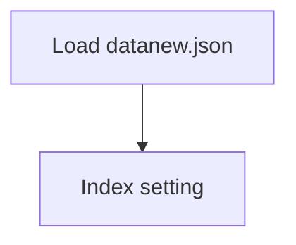

# Tracking of Covid-19

## 1. Project Overview

This project implements a **Exploratory Data Analysis** pipeline for **Tracking of Covid-19**.

| Property | Value |
|----------|-------|
| **ML Task** | Exploratory Data Analysis |
| **Dataset Status** | DOWNLOADED |

## 2. Dataset

**Data sources detected in code:**

- `datanew.json`

**Standardized data path:** `data/tracking_of_covid-19/`

## 3. Pipeline Overview

### Original Notebook Pipeline

**Preprocessing:**
- Index setting

## 4. ML Workflow



## 5. Notebook Summary

| Metric | Value |
|--------|-------|
| Total cells | 24 |
| Code cells | 21 |
| Markdown cells | 3 |

**⚠️ Live URL data sources (may be fragile):**

- `https://www.mohfw.gov.in/data/datanew.json`

## 6. Model Details

No model training in this project.

## 7. Project Structure

```
Tracking of Covid-19/
├── Tracking of COVID-19.ipynb
└── README.md
```

## 8. Setup & Installation

`pip install -r requirements.txt` from the workspace root.

**Key dependencies:**

- `matplotlib`
- `numpy`
- `pandas`

## 9. How to Run

Open and run the notebook(s) sequentially:

```bash
jupyter notebook
```

- Open `Tracking of COVID-19.ipynb` and run all cells

## 10. Testing

Automated tests are available in `tests/test_p041_*.py`:

```bash
python -m pytest tests/test_p041_*.py -v
```

Tests validate data loading and library imports.

## 11. Limitations

- No model training — this is an analysis/tutorial notebook only
- Data loaded from live URL(s) — may become unavailable
