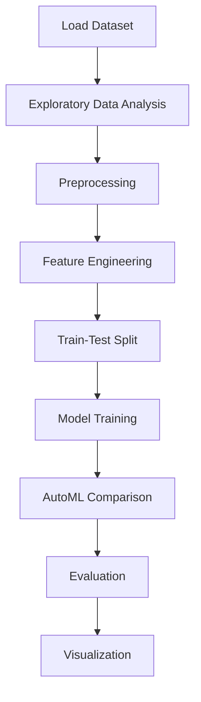

# Coffee Quality Analysis


## Project Overview

**Coffee Quality Analysis** is a **Classification** project in the **Data Analysis** category.

> The code identifies and prints the number of duplicate rows in the DataFrame 'df'. It first selects the duplicate rows using the duplicated() function and then prints the shape of the resulting DataFrame to show the number of duplicate rows found.

**Target variable:** `Total Cup Points`
**Models:** GradientBoosting, LazyClassifier, LogisticRegression, PyCaret, RandomForest, RandomForestRegressor

## Dataset

| Property | Value |
|----------|-------|
| Type | Tabular |
| Source | Local |
| Path | `data/coffee_quality_analysis/data.csv` |
| Target | `Total Cup Points` |

```python
from core.data_loader import load_dataset
df = load_dataset('coffee_quality_analysis')
```

## Pipeline Files

| File | Lines |
|------|-------|
| `pipeline.py` | 445 |
| `train.py` | 429 |
| `evaluate.py` | 429 |
| `code.ipynb` | 28 code / 32 markdown cells |
| `test_coffee_quality_analysis.py` | test suite |

## ML Workflow



## Core Logic

### Preprocessing

- Missing value imputation
- Label encoding
- One-hot encoding
- StandardScaler normalization
- MinMaxScaler normalization
- Datetime feature extraction
- Train-test split

### Feature Engineering

Feature engineering steps detected in notebook code cells.

### Visualizations

- Correlation heatmap
- Bar charts
- Scatter plots
- Confusion matrix

## Models

| Model | Type |
|-------|------|
| GradientBoosting | Ensemble / Boosting |
| LazyClassifier | AutoML Benchmark (30+ classifiers) |
| LogisticRegression | Linear Classifier |
| PyCaret | AutoML Framework |
| RandomForest | Tree-Based |
| RandomForestRegressor | Ensemble Regressor |

AutoML is toggled via the `USE_AUTOML` flag in pipeline scripts.
**LazyPredict** (`LazyClassifier`) benchmarks 30+ models automatically.
**PyCaret** `compare_models()` runs cross-validated comparison.

## Reproducibility

```python
random.seed(42); np.random.seed(42); os.environ['PYTHONHASHSEED'] = '42'
```

```bash
python pipeline.py --seed 123    # custom seed
python pipeline.py --reproduce   # locked seed=42
```

## Project Structure

```
Data Analysis/Coffee Quality Analysis/
  Coffe Quality Analysis.pdf
  README.md
  code.ipynb
  data.csv
  evaluate.py
  guideline.txt
  pipeline.py
  test_coffee_quality_analysis.py
  train.py
```

## How to Run

```bash
cd "Data Analysis/Coffee Quality Analysis"
python pipeline.py
python train.py       # training only
python evaluate.py    # evaluation only
```

## Testing

```bash
pytest "Data Analysis/Coffee Quality Analysis/test_coffee_quality_analysis.py" -v
```

## Setup

```bash
pip install lazypredict matplotlib numpy pandas pycaret scikit-learn seaborn
```

---
*README auto-generated from `code.ipynb` analysis.*