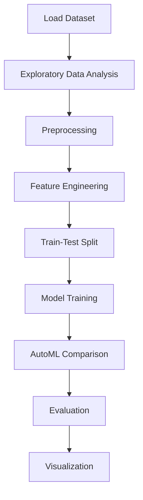

# Cybersecurity Anomaly Detection


## Project Overview

**Cybersecurity Anomaly Detection** is a **Classification** project in the **Data Analysis** category.

> The code checks if all the column names in `train_df`, `test_df`, and `validation_df` are the same, ensuring consistency among the datasets.

**Target variable:** `label`
**Models:** IsolationForest, LazyClassifier, PyCaret

## Dataset

| Property | Value |
|----------|-------|
| Type | Tabular |
| Source | Local |
| Path | `data/cybersecurity_anomaly/labelled_testing_data.csv` |
| Target | `label` |

```python
from core.data_loader import load_dataset
df = load_dataset('cybersecurity_anomaly_detection')
```

## Pipeline Files

| File | Lines |
|------|-------|
| `pipeline.py` | 583 |
| `train.py` | 471 |
| `evaluate.py` | 471 |
| `code.ipynb` | 75 code / 101 markdown cells |
| `test_cybersecurity_anomaly_detection.py` | test suite |

## ML Workflow



## Core Logic

### Preprocessing

- Missing value imputation
- One-hot encoding
- Train-test split

### Feature Engineering

Feature engineering steps detected in notebook code cells.

### Visualizations

- Correlation heatmap
- Box plots

### Helper Functions

- `dataset_to_corr_heatmap()`
- `column_uniques()`
- `strip_string()`
- `process_args_row()`
- `process_args_dataframe()`
- `prepare_dataset()`

## Models

| Model | Type |
|-------|------|
| IsolationForest | Anomaly Detection |
| LazyClassifier | AutoML Benchmark (30+ classifiers) |
| PyCaret | AutoML Framework |

AutoML is toggled via the `USE_AUTOML` flag in pipeline scripts.
**LazyPredict** (`LazyClassifier`) benchmarks 30+ models automatically.
**PyCaret** `compare_models()` runs cross-validated comparison.

## Reproducibility

```python
random.seed(42); np.random.seed(42); os.environ['PYTHONHASHSEED'] = '42'
```

```bash
python pipeline.py --seed 123    # custom seed
python pipeline.py --reproduce   # locked seed=42
```

## Project Structure

```
Data Analysis/Cybersecurity Anomaly Detection/
  Cybersecurity anomaly detection.pdf
  README.md
  code.ipynb
  data/
  evaluate.py
  guideline.txt
  pipeline.py
  test_cybersecurity_anomaly_detection.py
  train.py
```

## How to Run

```bash
cd "Data Analysis/Cybersecurity Anomaly Detection"
python pipeline.py
python train.py       # training only
python evaluate.py    # evaluation only
```

## Testing

```bash
pytest "Data Analysis/Cybersecurity Anomaly Detection/test_cybersecurity_anomaly_detection.py" -v
```

## Setup

```bash
pip install lazypredict matplotlib numpy pandas pycaret scikit-learn seaborn
```

---
*README auto-generated from `code.ipynb` analysis.*