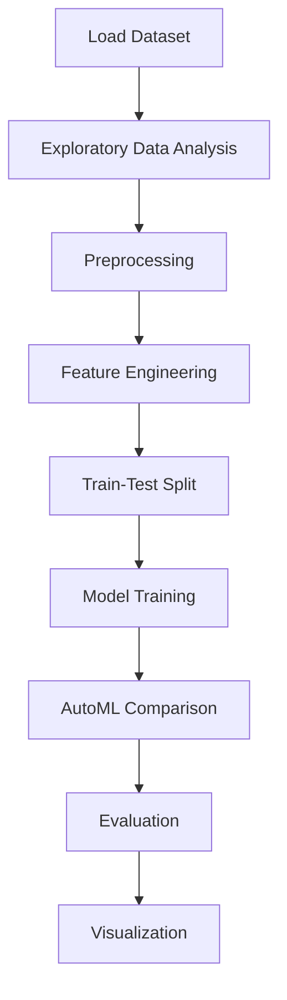

# Data Science Salaries Analysis


## Project Overview

**Data Science Salaries Analysis** is a **Classification** project in the **Data Analysis** category.

> The code calculates the missing ratio for each column in the 'data' DataFrame, excluding columns with no missing values. It sorts the missing ratios in descending order, selects the top 30 columns with the highest missing ratios, and creates a DataFrame called 'missing_data' with the column names and their corresponding missing ratios. The resulting DataFrame displays the top 20 columns with their missing ratios.

**Target variable:** `salary_range`
**Models:** GradientBoosting, LazyClassifier, LogisticRegression, PyCaret, RandomForest

## Dataset

| Property | Value |
|----------|-------|
| Type | Tabular |
| Source | Local |
| Path | `data/data_science_salaries/data.csv` |
| Target | `salary_range` |

```python
from core.data_loader import load_dataset
df = load_dataset('data_science_salaries_analysis')
```

## Pipeline Files

| File | Lines |
|------|-------|
| `pipeline.py` | 654 |
| `train.py` | 572 |
| `evaluate.py` | 609 |
| `code.ipynb` | 37 code / 73 markdown cells |
| `test_data_science_salaries_analysis.py` | test suite |

## ML Workflow



## Core Logic

### Preprocessing

- Missing value imputation
- Label encoding
- One-hot encoding
- StandardScaler normalization
- MinMaxScaler normalization
- Outlier removal
- Log transformation
- Train-test split

### Feature Engineering

Feature engineering steps detected in notebook code cells.

### Visualizations

- Correlation heatmap
- Histograms / distributions
- Box plots
- Bar charts
- Scatter plots
- Confusion matrix

### Helper Functions

- `assign_broader_category()`
- `country_code_to_name()`
- `country_code_to_name()`

## Models

| Model | Type |
|-------|------|
| GradientBoosting | Ensemble / Boosting |
| LazyClassifier | AutoML Benchmark (30+ classifiers) |
| LogisticRegression | Linear Classifier |
| PyCaret | AutoML Framework |
| RandomForest | Tree-Based |

AutoML is toggled via the `USE_AUTOML` flag in pipeline scripts.
**LazyPredict** (`LazyClassifier`) benchmarks 30+ models automatically.
**PyCaret** `compare_models()` runs cross-validated comparison.

## Reproducibility

```python
random.seed(42); np.random.seed(42); os.environ['PYTHONHASHSEED'] = '42'
```

```bash
python pipeline.py --seed 123    # custom seed
python pipeline.py --reproduce   # locked seed=42
```

## Project Structure

```
Data Analysis/Data Science Salaries Analysis/
  Data Science Salaries analysis.pdf
  README.md
  code.ipynb
  data.csv
  evaluate.py
  guideline.txt
  pipeline.py
  test_data_science_salaries_analysis.py
  train.py
```

## How to Run

```bash
cd "Data Analysis/Data Science Salaries Analysis"
python pipeline.py
python train.py       # training only
python evaluate.py    # evaluation only
```

## Testing

```bash
pytest "Data Analysis/Data Science Salaries Analysis/test_data_science_salaries_analysis.py" -v
```

## Setup

```bash
pip install lazypredict matplotlib numpy pandas pycaret scikit-learn seaborn
```

---
*README auto-generated from `code.ipynb` analysis.*