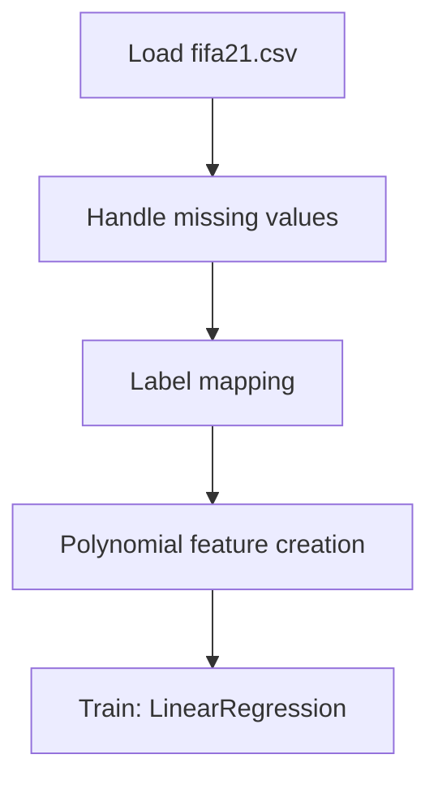

# fifa21_Data Cleaning

## 1. Project Overview

This project implements a **Regression** pipeline for **fifa21_Data Cleaning**.

| Property | Value |
|----------|-------|
| **ML Task** | Regression |
| **Dataset Status** | OK LOCAL |

## 2. Dataset

**Data sources detected in code:**

- `fifa21.csv`

**Files in project directory:**

- `fifa21.csv`
- `link_to_test.txt`

**Standardized data path:** `data/fifa21_data_cleaning/`

## 3. Pipeline Overview

### Original Notebook Pipeline

**Preprocessing:**
- Handle missing values (fillna)
- Label mapping (function)
- Polynomial feature creation

**Models trained:**
- LinearRegression

## 4. ML Workflow



## 5. Notebook Summary

| Metric | Value |
|--------|-------|
| Total cells | 41 |
| Code cells | 41 |
| Markdown cells | 0 |
| Original models | LinearRegression |

**⚠️ Deprecated APIs detected:**

- `sns.distplot()` is deprecated — use `sns.displot()` or `sns.histplot()`

## 6. Model Details

### Original Models

- `LinearRegression`

## 7. Project Structure

```
 fifa21_Data Cleaning/
├── fifa21-data-cleaning(1).ipynb
├── fifa21.csv
├── link_to_test.txt
└── README.md
```

## 8. Setup & Installation

`pip install -r requirements.txt` from the workspace root.

**Key dependencies:**

- `matplotlib`
- `numpy`
- `pandas`
- `scikit-learn`
- `seaborn`

## 9. How to Run

Open and run the notebook(s) sequentially:

```bash
jupyter notebook
```

- Open `fifa21-data-cleaning(1).ipynb` and run all cells

## 10. Testing

Automated tests are available in `tests/test_p151_*.py`:

```bash
python -m pytest tests/test_p151_*.py -v
```

Tests validate data loading and model instantiation.

## 11. Limitations

- `sns.distplot()` is deprecated — use `sns.displot()` or `sns.histplot()`
- No train/test split detected in code
- No evaluation metrics found in original code
