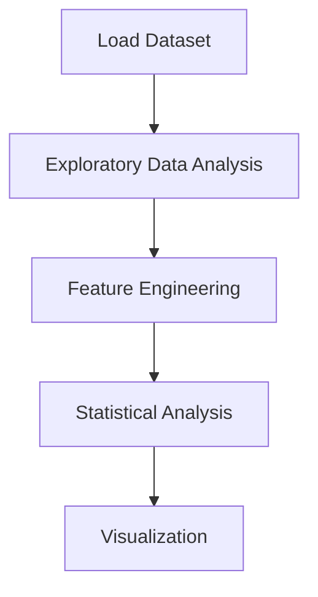

# Food Delivery Analysis


## Project Overview

**Food Delivery Analysis** is a **Exploratory Data Analysis** project in the **Data Analysis** category.

> This dataset was collected from the **residents of Bangalore** which studies on factors which are contributing to the demand of food delivery in the city.


## Dataset

| Property | Value |
|----------|-------|
| Type | Tabular |
| Source | Local |
| Path | `data/food_delivery_analysis/data.csv` |

```python
from core.data_loader import load_dataset
df = load_dataset('food_delivery_analysis')
```

## Pipeline Files

| File | Lines |
|------|-------|
| `pipeline.py` | 790 |
| `code.ipynb` | 28 code / 70 markdown cells |
| `test_food_delivery_analysis.py` | test suite |

## ML Workflow



## Core Logic

### Feature Engineering

Feature engineering steps detected in notebook code cells.

### Visualizations

- Correlation heatmap
- Histograms / distributions
- Count plots
- Box plots
- Bar charts
- Word cloud

## Models

This project focuses on exploratory data analysis without explicit ML modeling.

## Reproducibility

```python
random.seed(42); np.random.seed(42); os.environ['PYTHONHASHSEED'] = '42'
```

```bash
python pipeline.py --seed 123    # custom seed
python pipeline.py --reproduce   # locked seed=42
```

## Project Structure

```
Data Analysis/Food Delivery Analysis/
  Food Delivery Analysis.pdf
  README.md
  code.ipynb
  data.csv
  guideline.txt
  pipeline.py
  test_food_delivery_analysis.py
```

## How to Run

```bash
cd "Data Analysis/Food Delivery Analysis"
python pipeline.py
```

## Testing

```bash
pytest "Data Analysis/Food Delivery Analysis/test_food_delivery_analysis.py" -v
```

## Setup

```bash
pip install matplotlib nltk numpy pandas scikit-learn seaborn textblob wordcloud
```

---
*README auto-generated from `code.ipynb` analysis.*