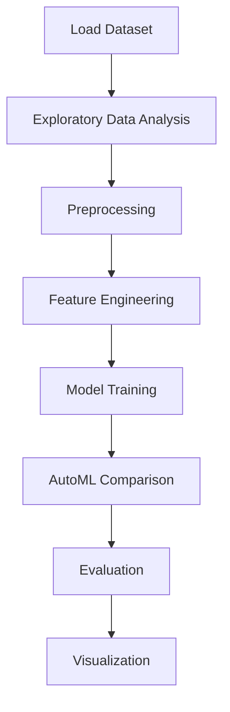

# Medical Insurance Cost Analysis


## Project Overview

**Medical Insurance Cost Analysis** is a **Exploratory Data Analysis** project in the **Data Analysis** category.

> The code creates a plot to visualize the distribution of the 'charges' variable using a kernel density estimation (KDE) plot. It sets the style to 'whitegrid', creates a figure and axes object, plots the distribution using sns.distplot, and sets the title of the plot to 'Distribution of Charges'.

**Target variable:** `charges`
**Models:** LazyRegressor, PyCaret

## Dataset

| Property | Value |
|----------|-------|
| Type | Tabular |
| Source | Local |
| Path | `data/medical_insurance_cost/data.csv` |
| Target | `charges` |

```python
from core.data_loader import load_dataset
df = load_dataset('medical_insurance_cost_analysis')
```

## Pipeline Files

| File | Lines |
|------|-------|
| `pipeline.py` | 220 |
| `train.py` | 170 |
| `evaluate.py` | 170 |
| `code.ipynb` | 22 code / 22 markdown cells |
| `test_medical_insurance_cost_analysis.py` | test suite |

## ML Workflow



## Core Logic

### Preprocessing

- Missing value imputation
- Label encoding
- One-hot encoding
- Log transformation
- Train-test split

### Feature Engineering

Feature engineering steps detected in notebook code cells.

### Visualizations

- Correlation heatmap
- Histograms / distributions
- Bar charts

## Models

| Model | Type |
|-------|------|
| LazyRegressor | AutoML Benchmark (30+ regressors) |
| PyCaret | AutoML Framework |

AutoML is toggled via the `USE_AUTOML` flag in pipeline scripts.
**LazyPredict** (`LazyRegressor`) benchmarks 30+ models automatically.
**PyCaret** `compare_models()` runs cross-validated comparison.

## Reproducibility

```python
random.seed(42); np.random.seed(42); os.environ['PYTHONHASHSEED'] = '42'
```

```bash
python pipeline.py --seed 123    # custom seed
python pipeline.py --reproduce   # locked seed=42
```

## Project Structure

```
Data Analysis/Medical Insurance Cost Analysis/
  Medical insurance cost analysis.pdf
  README.md
  code.ipynb
  data.csv
  evaluate.py
  guideline.txt
  pipeline.py
  test_medical_insurance_cost_analysis.py
  train.py
```

## How to Run

```bash
cd "Data Analysis/Medical Insurance Cost Analysis"
python pipeline.py
python train.py       # training only
python evaluate.py    # evaluation only
```

## Testing

```bash
pytest "Data Analysis/Medical Insurance Cost Analysis/test_medical_insurance_cost_analysis.py" -v
```

## Setup

```bash
pip install lazypredict matplotlib numpy pandas pycaret scikit-learn seaborn
```

---
*README auto-generated from `code.ipynb` analysis.*