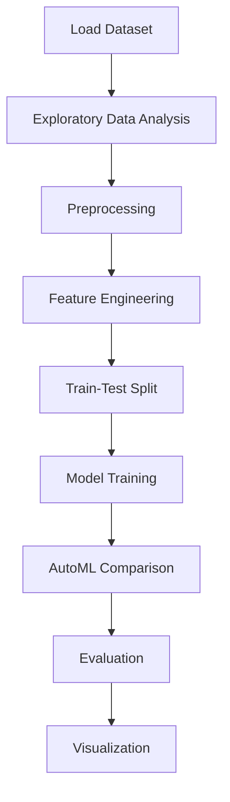

# Melbourne Housing Price Analysis


## Project Overview

**Melbourne Housing Price Analysis** is a **Regression** project in the **Data Analysis** category.

> The code corrects the format of the "Date" column in the dataset by splitting it into day, month, and year components. It then rearranges the components to form a new date string in the format "YYYY/MM/DD". The code converts this new date string to a datetime object using the pd.to_datetime() function. After that, it drops the intermediate columns and creates additional variables such as "Month_name", "day", and "Year" based on the modified date column for future analysis.

**Target variable:** `Price`
**Models:** LazyRegressor, PyCaret, RandomForest

## Dataset

| Property | Value |
|----------|-------|
| Type | Tabular |
| Source | Local |
| Path | `data/melbourne_housing_price/data.csv` |
| Target | `Price` |

```python
from core.data_loader import load_dataset
df = load_dataset('melbourne_housing_price_analysis')
```

## Pipeline Files

| File | Lines |
|------|-------|
| `pipeline.py` | 532 |
| `train.py` | 366 |
| `evaluate.py` | 366 |
| `code.ipynb` | 70 code / 70 markdown cells |
| `test_melbourne_housing_price_analysis.py` | test suite |

## ML Workflow



## Core Logic

### Preprocessing

- Label encoding
- Outlier removal
- Datetime feature extraction
- Train-test split

### Feature Engineering

Feature engineering steps detected in notebook code cells.

### Visualizations

- Correlation heatmap
- Histograms / distributions
- Box plots
- Bar charts

### Helper Functions

- `diagnostic_plot()`

## Models

| Model | Type |
|-------|------|
| LazyRegressor | AutoML Benchmark (30+ regressors) |
| PyCaret | AutoML Framework |
| RandomForest | Tree-Based |

AutoML is toggled via the `USE_AUTOML` flag in pipeline scripts.
**LazyPredict** (`LazyRegressor`) benchmarks 30+ models automatically.
**PyCaret** `compare_models()` runs cross-validated comparison.

## Reproducibility

```python
random.seed(42); np.random.seed(42); os.environ['PYTHONHASHSEED'] = '42'
```

```bash
python pipeline.py --seed 123    # custom seed
python pipeline.py --reproduce   # locked seed=42
```

## Project Structure

```
Data Analysis/Melbourne Housing Price Analysis/
  Melbourne Housing Price Analysis.pdf
  README.md
  code.ipynb
  data.csv
  evaluate.py
  guideline.txt
  pipeline.py
  test_melbourne_housing_price_analysis.py
  train.py
```

## How to Run

```bash
cd "Data Analysis/Melbourne Housing Price Analysis"
python pipeline.py
python train.py       # training only
python evaluate.py    # evaluation only
```

## Testing

```bash
pytest "Data Analysis/Melbourne Housing Price Analysis/test_melbourne_housing_price_analysis.py" -v
```

## Setup

```bash
pip install lazypredict matplotlib numpy pandas pycaret scikit-learn seaborn
```

---
*README auto-generated from `code.ipynb` analysis.*