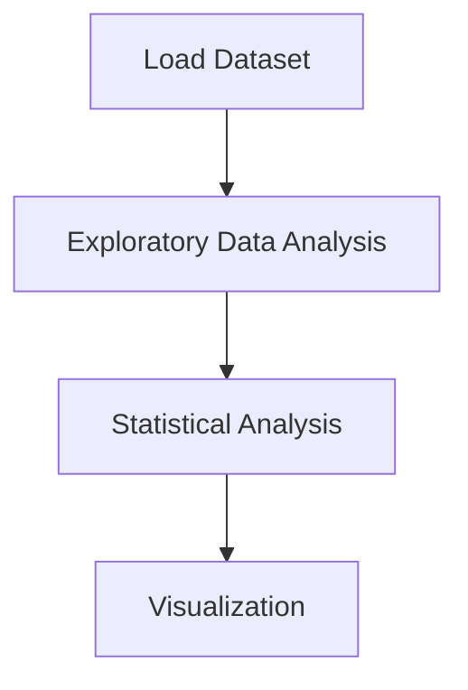

# Sleep Health Analysis


## Project Overview

**Sleep Health Analysis** is a **Exploratory Data Analysis** project in the **Data Analysis** category.

> The code prints the unique values of the 'Occupation' column in the DataFrame 'df'.

**Target variable:** `Blood Pressure`

## Dataset

| Property | Value |
|----------|-------|
| Type | Tabular |
| Source | Local |
| Path | `data/sleep_health_analysis/data.csv` |
| Target | `Blood Pressure` |

```python
from core.data_loader import load_dataset
df = load_dataset('sleep_health_analysis')
```

## Pipeline Files

| File | Lines |
|------|-------|
| `pipeline.py` | 257 |
| `code.ipynb` | 37 code / 54 markdown cells |
| `test_sleep_health_analysis.py` | test suite |

## ML Workflow



## Core Logic

### Visualizations

- Correlation heatmap
- Histograms / distributions
- Box plots
- Pair plots
- Scatter plots

## Models

This project focuses on exploratory data analysis without explicit ML modeling.

## Reproducibility

```python
random.seed(42); np.random.seed(42); os.environ['PYTHONHASHSEED'] = '42'
```

```bash
python pipeline.py --seed 123    # custom seed
python pipeline.py --reproduce   # locked seed=42
```

## Project Structure

```
Data Analysis/Sleep Health Analysis/
  README.md
  Sleep Health Analysis.pdf
  code.ipynb
  data.csv
  guideline.txt
  pipeline.py
  test_sleep_health_analysis.py
```

## How to Run

```bash
cd "Data Analysis/Sleep Health Analysis"
python pipeline.py
```

## Testing

```bash
pytest "Data Analysis/Sleep Health Analysis/test_sleep_health_analysis.py" -v
```

## Setup

```bash
pip install matplotlib numpy pandas scikit-learn seaborn
```

---
*README auto-generated from `code.ipynb` analysis.*