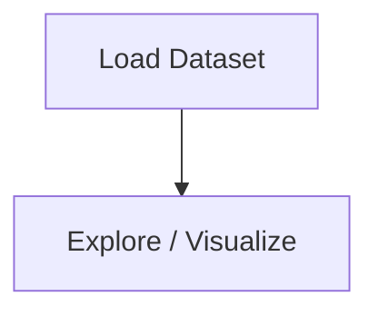

# Spark DataFrames Project Exercise_Udemy

## 1. Project Overview

This project implements a **Exploratory Data Analysis** pipeline for **Spark DataFrames Project Exercise_Udemy**.

| Property | Value |
|----------|-------|
| **ML Task** | Exploratory Data Analysis |
| **Dataset Status** | OK LOCAL |

## 2. Dataset

**Files in project directory:**

- `WMT.csv`

**Standardized data path:** `data/spark_dataframes_project_exercise_udemy/`

## 3. Pipeline Overview

The original notebook primarily contains data loading and exploratory data analysis.

## 4. ML Workflow



## 5. Notebook Summary

| Metric | Value |
|--------|-------|
| Total cells | 48 |
| Code cells | 28 |
| Markdown cells | 20 |

## 6. Model Details

No model training in this project.

## 7. Project Structure

```
Spark DataFrames Project Exercise_Udemy/
├── Spark DataFrames Project Exercise_Udemy.ipynb
├── WMT.csv
└── README.md
```

## 8. Setup & Installation

`pip install -r requirements.txt` from the workspace root.

## 9. How to Run

Open and run the notebook(s) sequentially:

```bash
jupyter notebook
```

- Open `Spark DataFrames Project Exercise_Udemy.ipynb` and run all cells

## 10. Testing

Automated tests are available in `tests/test_p121_*.py`:

```bash
python -m pytest tests/test_p121_*.py -v
```

Tests validate data loading and library imports.

## 11. Limitations

- No model training — this is an analysis/tutorial notebook only
