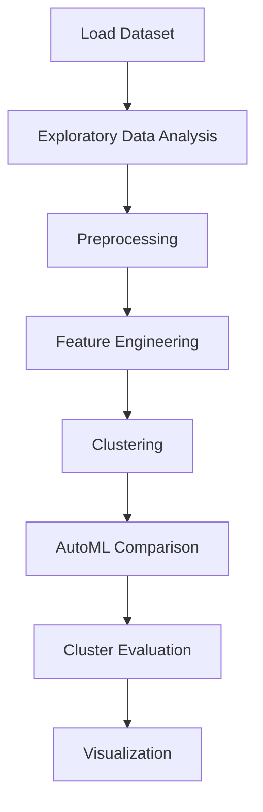

# Spotify Health Clustering


## Project Overview

**Spotify Health Clustering** is a **Clustering** project in the **Data Analysis** category.

> Printing the name of columns and the first five rows of data frame

**Target variable:** `popularity`
**Models:** KMeans, PyCaret

## Dataset

| Property | Value |
|----------|-------|
| Type | Tabular |
| Source | Local |
| Path | `data/spotify_health_clustering/train.csv` |
| Target | `popularity` |

```python
from core.data_loader import load_dataset
df = load_dataset('spotify_health_clustering')
```

## Pipeline Files

| File | Lines |
|------|-------|
| `pipeline.py` | 255 |
| `train.py` | 190 |
| `evaluate.py` | 190 |
| `code.ipynb` | 25 code / 34 markdown cells |
| `test_spotify_health_clustering.py` | test suite |

## ML Workflow



## Core Logic

### Preprocessing

- StandardScaler normalization

### Feature Engineering

Feature engineering steps detected in notebook code cells.

### Visualizations

- Histograms / distributions
- Bar charts
- Scatter plots
- Elbow method
- Silhouette analysis

## Models

| Model | Type |
|-------|------|
| KMeans | Centroid Clustering |
| PyCaret | AutoML Framework |

AutoML is toggled via the `USE_AUTOML` flag in pipeline scripts.
**PyCaret** `compare_models()` runs cross-validated comparison.

## Reproducibility

```python
random.seed(42); np.random.seed(42); os.environ['PYTHONHASHSEED'] = '42'
```

```bash
python pipeline.py --seed 123    # custom seed
python pipeline.py --reproduce   # locked seed=42
```

## Project Structure

```
Data Analysis/Spotify Health Clustering/
  README.md
  Spotify health analysis.pdf
  code.ipynb
  evaluate.py
  guideline.txt
  pipeline.py
  test_spotify_health_clustering.py
  train.py
```

## How to Run

```bash
cd "Data Analysis/Spotify Health Clustering"
python pipeline.py
python train.py       # training only
python evaluate.py    # evaluation only
```

## Testing

```bash
pytest "Data Analysis/Spotify Health Clustering/test_spotify_health_clustering.py" -v
```

## Setup

```bash
pip install matplotlib numpy pandas pycaret scikit-learn seaborn
```

---
*README auto-generated from `code.ipynb` analysis.*