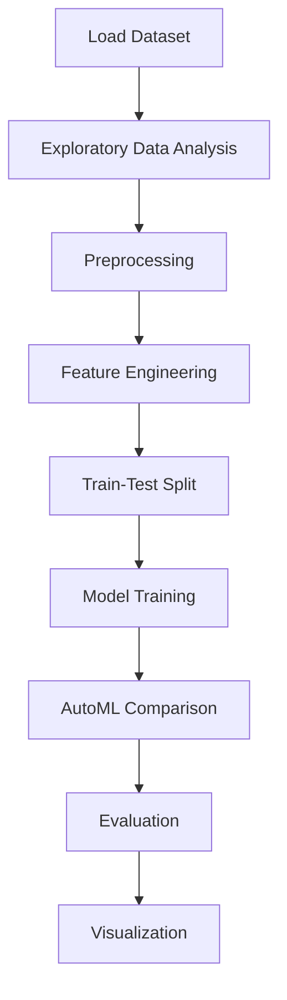

# Student Alcohol Consumption Analysis


## Project Overview

**Student Alcohol Consumption Analysis** is a **Classification** project in the **Data Analysis** category.

> The code computes and prints the frequency distribution of each categorical column in the dataset. It displays the count of unique values for each column.

**Target variable:** `failures`
**Models:** LazyClassifier, PyCaret

## Dataset

| Property | Value |
|----------|-------|
| Type | Tabular |
| Source | Local |
| Path | `data/student_alcohol_consumption/data.csv` |
| Target | `failures` |

```python
from core.data_loader import load_dataset
df = load_dataset('student_alcohol_consumption_analysis')
```

## Pipeline Files

| File | Lines |
|------|-------|
| `pipeline.py` | 274 |
| `train.py` | 164 |
| `evaluate.py` | 164 |
| `code.ipynb` | 29 code / 49 markdown cells |
| `test_student_alcohol_consumption_analysis.py` | test suite |

## ML Workflow



## Core Logic

### Preprocessing

- Missing value imputation
- One-hot encoding
- Train-test split

### Feature Engineering

Feature engineering steps detected in notebook code cells.

### Visualizations

- Correlation heatmap
- Histograms / distributions
- Count plots
- Box plots
- Bar charts

## Models

| Model | Type |
|-------|------|
| LazyClassifier | AutoML Benchmark (30+ classifiers) |
| PyCaret | AutoML Framework |

AutoML is toggled via the `USE_AUTOML` flag in pipeline scripts.
**LazyPredict** (`LazyClassifier`) benchmarks 30+ models automatically.
**PyCaret** `compare_models()` runs cross-validated comparison.

## Reproducibility

```python
random.seed(42); np.random.seed(42); os.environ['PYTHONHASHSEED'] = '42'
```

```bash
python pipeline.py --seed 123    # custom seed
python pipeline.py --reproduce   # locked seed=42
```

## Project Structure

```
Data Analysis/Student Alcohol Consumption Analysis/
  README.md
  Student Alcohol Consumption Analysis.pdf
  code.ipynb
  data.csv
  evaluate.py
  guideline.txt
  pipeline.py
  test_student_alcohol_consumption_analysis.py
  train.py
```

## How to Run

```bash
cd "Data Analysis/Student Alcohol Consumption Analysis"
python pipeline.py
python train.py       # training only
python evaluate.py    # evaluation only
```

## Testing

```bash
pytest "Data Analysis/Student Alcohol Consumption Analysis/test_student_alcohol_consumption_analysis.py" -v
```

## Setup

```bash
pip install lazypredict matplotlib numpy pandas pycaret scikit-learn seaborn
```

---
*README auto-generated from `code.ipynb` analysis.*