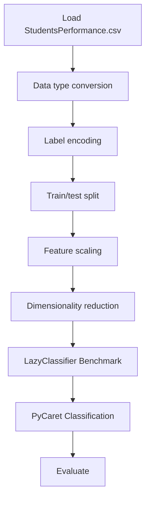

# Student Performance Analysis

## 1. Project Overview

This project implements a **Classification** pipeline for **Student Performance Analysis**.

| Property | Value |
|----------|-------|
| **ML Task** | Classification |
| **Dataset Status** | OK LOCAL |
| **Standardized Pipeline** | Yes (LazyPredict + PyCaret) |

## 2. Dataset

**Data sources detected in code:**

- `StudentsPerformance.csv`

**Files in project directory:**

- `StudentsPerformance.csv`

**Standardized data path:** `data/student_performance_analysis/`

## 3. Pipeline Overview

### Original Notebook Pipeline

**Preprocessing:**
- Data type conversion
- Label encoding (LabelEncoder)
- Train/test split
- Feature scaling (MinMaxScaler)
- Dimensionality reduction (PCA)

### Standardized Pipeline (added)

- **LazyClassifier**: Automated comparison of multiple models in a single call
- **PyCaret Classification**: Full AutoML pipeline (setup → compare → tune → evaluate → finalize)

## 4. ML Workflow



## 5. Notebook Summary

| Metric | Value |
|--------|-------|
| Total cells | 88 |
| Code cells | 58 |
| Markdown cells | 30 |
| Original cells | 75 |
| Standardized cells (added) | 13 |
| Original model training | None — preprocessing/EDA only |

**⚠️ Deprecated APIs detected:**

- `sns.distplot()` is deprecated — use `sns.displot()` or `sns.histplot()`

## 6. Model Details

### LazyClassifier (Standardized)

Compares 20+ classifiers, ranked by accuracy/F1.

### PyCaret Classification (Standardized)

AutoML pipeline: `setup()` → `compare_models()` → `tune_model()` → `finalize_model()`

> ⚠️ Requires Python ≤ 3.11.

## 7. Project Structure

```
Student Performance Analysis/
├── student-performance-analysis.ipynb
├── StudentsPerformance.csv
└── README.md
```

## 8. Setup & Installation

`pip install -r requirements.txt` from the workspace root.

**Key dependencies:**

- `lazypredict`
- `matplotlib`
- `numpy`
- `pandas`
- `plotly`
- `pycaret`
- `scikit-learn`
- `scipy`
- `seaborn`

## 9. How to Run

Open and run the notebook(s) sequentially:

```bash
jupyter notebook
```

- Open `student-performance-analysis.ipynb` and run all cells

## 10. Testing

Automated tests are available in `tests/test_p036_*.py`:

```bash
python -m pytest tests/test_p036_*.py -v
```

Tests validate data loading and model instantiation.

## 11. Limitations

- PyCaret cells require Python ≤ 3.11 — they will fail on Python 3.12+
- `sns.distplot()` is deprecated — use `sns.displot()` or `sns.histplot()`
- No original model training exists — only auto-generated LazyPredict/PyCaret cells

## 12. Cleanup Notes

Cells added during workspace standardization:

- **LazyClassifier** benchmark cell
- **PyCaret Classification** pipeline cell
