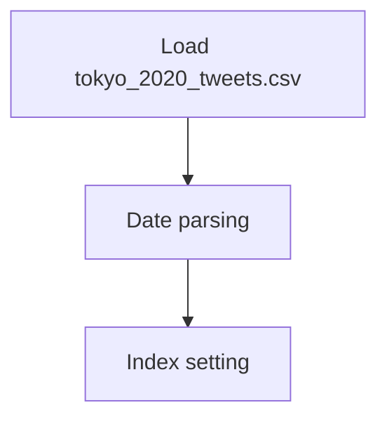

# Tokyo 2020 Monitor Tweets Frequency

## 1. Project Overview

This project implements a **Exploratory Data Analysis** pipeline for **Tokyo 2020 Monitor Tweets Frequency**.

| Property | Value |
|----------|-------|
| **ML Task** | Exploratory Data Analysis |
| **Dataset Status** | OK LOCAL |

## 2. Dataset

**Data sources detected in code:**

- `tokyo_2020_tweets.csv`

**Files in project directory:**

- `link_to_dataset.txt`
- `tokyo_2020_tweets.csv`

**Standardized data path:** `data/tokyo_2020_monitor_tweets_frequency/`

## 3. Pipeline Overview

### Original Notebook Pipeline

**Preprocessing:**
- Date parsing
- Index setting

## 4. ML Workflow



## 5. Notebook Summary

| Metric | Value |
|--------|-------|
| Total cells | 18 |
| Code cells | 18 |
| Markdown cells | 0 |

## 6. Model Details

No model training in this project.

## 7. Project Structure

```
Tokyo 2020 Monitor Tweets Frequency/
├── tokyo-2020-monitor-tweets-frequency(1).ipynb
├── link_to_dataset.txt
├── tokyo_2020_tweets.csv
└── README.md
```

## 8. Setup & Installation

`pip install -r requirements.txt` from the workspace root.

**Key dependencies:**

- `matplotlib`
- `numpy`
- `pandas`
- `seaborn`

## 9. How to Run

Open and run the notebook(s) sequentially:

```bash
jupyter notebook
```

- Open `tokyo-2020-monitor-tweets-frequency(1).ipynb` and run all cells

## 10. Testing

Automated tests are available in `tests/test_p157_*.py`:

```bash
python -m pytest tests/test_p157_*.py -v
```

Tests validate data loading and library imports.

## 11. Limitations

- No model training — this is an analysis/tutorial notebook only
