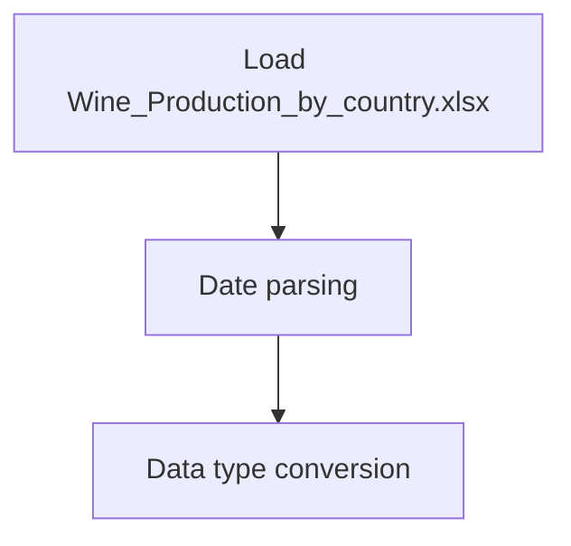

# Wine Production Analysis

## 1. Project Overview

This project implements a **Exploratory Data Analysis** pipeline for **Wine Production Analysis**.

| Property | Value |
|----------|-------|
| **ML Task** | Exploratory Data Analysis |
| **Dataset Status** | OK LOCAL |

## 2. Dataset

**Data sources detected in code:**

- `Wine_Production_by_country.xlsx`

**Files in project directory:**

- `link_to_dataset.txt`
- `Wine_Production_by_country.xlsx`

**Standardized data path:** `data/wine_production_analysis/`

## 3. Pipeline Overview

### Original Notebook Pipeline

**Preprocessing:**
- Date parsing
- Data type conversion

## 4. ML Workflow



## 5. Notebook Summary

| Metric | Value |
|--------|-------|
| Total cells | 51 |
| Code cells | 37 |
| Markdown cells | 14 |

## 6. Model Details

No model training in this project.

## 7. Project Structure

```
Wine Production Analysis/
├── wine-production-analysis(1).ipynb
├── wine-production-analysis.ipynb
├── Wine_Production_by_country.xlsx
├── link_to_dataset.txt
└── README.md
```

## 8. Setup & Installation

`pip install -r requirements.txt` from the workspace root.

**Key dependencies:**

- `matplotlib`
- `pandas`
- `seaborn`

## 9. How to Run

Open and run the notebook(s) sequentially:

```bash
jupyter notebook
```

- Open `wine-production-analysis(1).ipynb` and run all cells
- Open `wine-production-analysis.ipynb` and run all cells

## 10. Testing

Automated tests are available in `tests/test_p081_*.py`:

```bash
python -m pytest tests/test_p081_*.py -v
```

Tests validate data loading and library imports.

## 11. Limitations

- No model training — this is an analysis/tutorial notebook only
