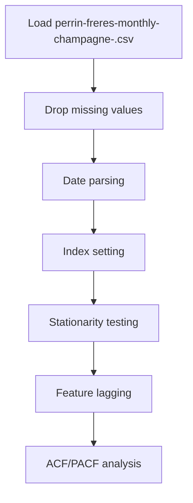

# Forecasting using ARIMA

## 1. Project Overview

This project implements a **Time Series Analysis** pipeline for **Forecasting using ARIMA**.

| Property | Value |
|----------|-------|
| **ML Task** | Time Series Analysis |
| **Dataset Status** | OK LOCAL |

## 2. Dataset

**Data sources detected in code:**

- `perrin-freres-monthly-champagne-.csv`

**Files in project directory:**

- `perrin-freres-monthly-champagne-.csv`

**Standardized data path:** `data/forecasting_using_arima/`

## 3. Pipeline Overview

### Original Notebook Pipeline

**Preprocessing:**
- Drop missing values (dropna)
- Date parsing
- Index setting
- Stationarity testing (ADF)
- Feature lagging (shift)
- ACF/PACF analysis

## 4. ML Workflow



## 5. Notebook Summary

| Metric | Value |
|--------|-------|
| Total cells | 26 |
| Code cells | 24 |
| Markdown cells | 2 |

## 6. Model Details

No model training in this project.

## 7. Project Structure

```
Forecasting using ARIMA/
├── Untitled.ipynb
├── perrin-freres-monthly-champagne-.csv
└── README.md
```

## 8. Setup & Installation

`pip install -r requirements.txt` from the workspace root.

**Key dependencies:**

- `matplotlib`
- `numpy`
- `pandas`
- `statsmodels`

## 9. How to Run

Open and run the notebook(s) sequentially:

```bash
jupyter notebook
```

- Open `Untitled.ipynb` and run all cells

## 10. Testing

Automated tests are available in `tests/test_p015_*.py`:

```bash
python -m pytest tests/test_p015_*.py -v
```

Tests validate data loading and library imports.

## 11. Limitations

- No model training — this is an analysis/tutorial notebook only
- Notebook uses default name (`Untitled.ipynb`)
