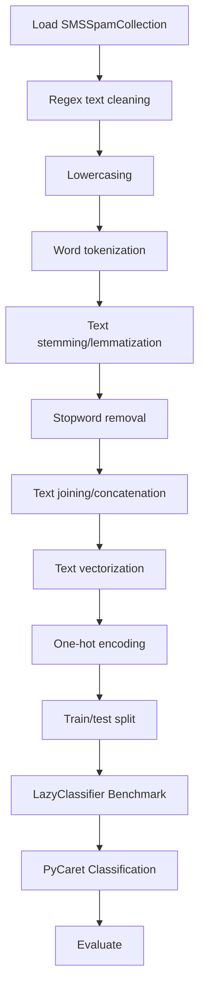

# Spam Classifier

## 1. Project Overview

This project implements a **Classification** pipeline for **Spam Classifier**. The target variable is `label`.

| Property | Value |
|----------|-------|
| **ML Task** | Classification |
| **Target Variable** | `label` |
| **Dataset Status** | OK LOCAL |
| **Standardized Pipeline** | Yes (LazyPredict + PyCaret) |

## 2. Dataset

**Data sources detected in code:**

- `SMSSpamCollection`

## 3. Pipeline Overview

### Original Notebook Pipeline

**Preprocessing:**
- Regex text cleaning
- Lowercasing
- Word tokenization (NLTK)
- Text stemming/lemmatization
- Stopword removal
- Text joining/concatenation
- Text vectorization (CountVectorizer)
- One-hot encoding (pd.get_dummies)
- Train/test split

### Standardized Pipeline (added)

- **LazyClassifier**: Automated comparison of multiple models in a single call
- **PyCaret Classification**: Full AutoML pipeline (setup → compare → tune → evaluate → finalize)

## 4. ML Workflow



## 5. Notebook Summary

| Metric | Value |
|--------|-------|
| Total cells | 30 |
| Code cells | 23 |
| Markdown cells | 7 |
| Original cells | 17 |
| Standardized cells (added) | 13 |
| Original model training | None — preprocessing/EDA only |

## 6. Model Details

### LazyClassifier (Standardized)

Compares 20+ classifiers, ranked by accuracy/F1.

### PyCaret Classification (Standardized)

AutoML pipeline: `setup()` → `compare_models()` → `tune_model()` → `finalize_model()`

> ⚠️ Requires Python ≤ 3.11.

## 7. Project Structure

```
Spam Classifier/
├── Untitled.ipynb
├── smsspamcollection
└── README.md
```

## 8. Setup & Installation

`pip install -r requirements.txt` from the workspace root.

**Key dependencies:**

- `lazypredict`
- `matplotlib`
- `nltk`
- `pandas`
- `pycaret`
- `scikit-learn`

## 9. How to Run

Open and run the notebook(s) sequentially:

```bash
jupyter notebook
```

- Open `Untitled.ipynb` and run all cells

## 10. Testing

Automated tests are available in `tests/test_p035_*.py`:

```bash
python -m pytest tests/test_p035_*.py -v
```

Tests validate data loading and model instantiation.

## 11. Limitations

- PyCaret cells require Python ≤ 3.11 — they will fail on Python 3.12+
- No original model training exists — only auto-generated LazyPredict/PyCaret cells
- Notebook uses default name (`Untitled.ipynb`)

## 12. Cleanup Notes

Cells added during workspace standardization:

- **LazyClassifier** benchmark cell
- **PyCaret Classification** pipeline cell
