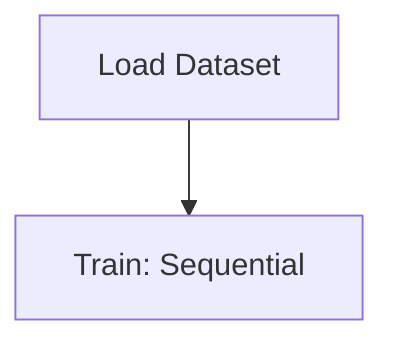

# TIme Series Forecasting

## 1. Project Overview

This project implements a **Time Series Forecasting** pipeline for **TIme Series Forecasting**.

| Property | Value |
|----------|-------|
| **ML Task** | Time Series Forecasting |
| **Dataset Status** | OK BUILTIN |

## 2. Dataset

## 3. Pipeline Overview

### Original Notebook Pipeline

**Models trained:**
- Sequential

## 4. ML Workflow



## 5. Notebook Summary

| Metric | Value |
|--------|-------|
| Total cells | 19 |
| Code cells | 16 |
| Markdown cells | 3 |
| Original models | Sequential |

## 6. Model Details

### Original Models

- `Sequential`

**Neural network architecture:**

```
  LSTM(50)
  Dense(1)
```

## 7. Project Structure

```
TIme Series Forecasting/
├── time_serires_forecasting.ipynb
└── README.md
```

## 8. Setup & Installation

`pip install -r requirements.txt` from the workspace root.

**Key dependencies:**

- `keras`
- `matplotlib`
- `numpy`
- `tensorflow`

## 9. How to Run

Open and run the notebook(s) sequentially:

```bash
jupyter notebook
```

- Open `time_serires_forecasting.ipynb` and run all cells

## 10. Testing

Automated tests are available in `tests/test_p038_*.py`:

```bash
python -m pytest tests/test_p038_*.py -v
```

Tests validate data loading and model instantiation.

## 11. Limitations

- No train/test split detected in code
- No evaluation metrics found in original code
