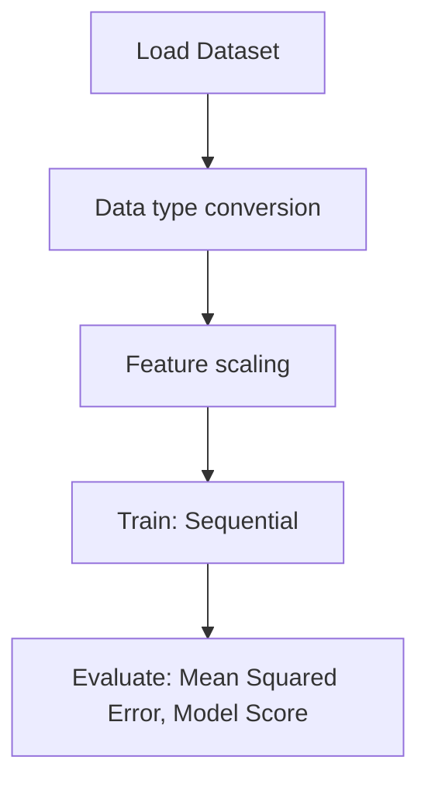

# TIme Series With LSTM

## 1. Project Overview

This project implements a **Time Series Forecasting** pipeline for **TIme Series With LSTM**.

| Property | Value |
|----------|-------|
| **ML Task** | Time Series Forecasting |
| **Dataset Status** | OK LOCAL |

## 2. Dataset

**Files in project directory:**

- `airline-passengers.csv`

**Standardized data path:** `data/time_series_with_lstm/`

## 3. Pipeline Overview

### Original Notebook Pipeline

**Preprocessing:**
- Data type conversion
- Feature scaling (MinMaxScaler)

**Models trained:**
- Sequential

**Evaluation metrics:**
- Mean Squared Error
- Model Score

## 4. ML Workflow



## 5. Notebook Summary

| Metric | Value |
|--------|-------|
| Total cells | 14 |
| Code cells | 14 |
| Markdown cells | 0 |
| Original models | Sequential |

## 6. Model Details

### Original Models

- `Sequential`

**Neural network architecture:**

```
  LSTM(4)
  Dense(1)
```

### Evaluation Metrics

- Mean Squared Error
- Model Score

## 7. Project Structure

```
TIme Series With LSTM/
├── Untitled.ipynb
├── airline-passengers.csv
└── README.md
```

## 8. Setup & Installation

`pip install -r requirements.txt` from the workspace root.

**Key dependencies:**

- `keras`
- `matplotlib`
- `numpy`
- `pandas`
- `scikit-learn`
- `tensorflow`

## 9. How to Run

Open and run the notebook(s) sequentially:

```bash
jupyter notebook
```

- Open `Untitled.ipynb` and run all cells

## 10. Testing

Automated tests are available in `tests/test_p039_*.py`:

```bash
python -m pytest tests/test_p039_*.py -v
```

Tests validate data loading and model instantiation.

## 11. Limitations

- Notebook uses default name (`Untitled.ipynb`)
