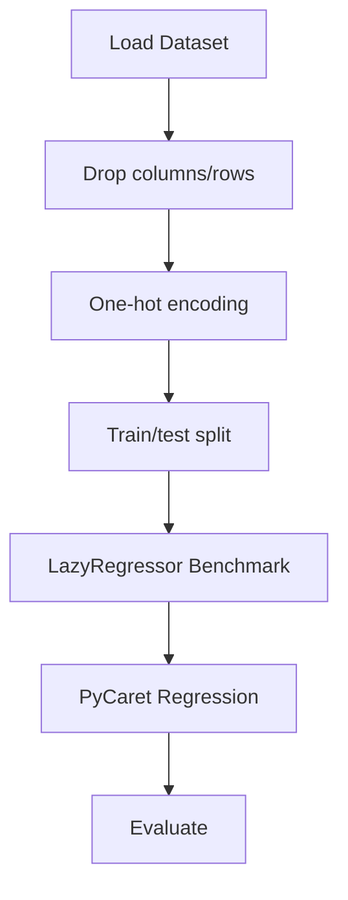

# Car Price Prediction

## 1. Project Overview

This project implements a **Regression** pipeline for **Car Price Prediction**. The target variable is `Year`.

| Property | Value |
|----------|-------|
| **ML Task** | Regression |
| **Target Variable** | `Year` |
| **Dataset Status** | OK LOCAL |
| **Standardized Pipeline** | Yes (LazyPredict + PyCaret) |

## 2. Dataset

**Files in project directory:**

- `car_data.csv`

**Standardized data path:** `data/car_price_prediction/`

## 3. Pipeline Overview

### Original Notebook Pipeline

**Preprocessing:**
- Drop columns/rows
- One-hot encoding (pd.get_dummies)
- Train/test split

### Standardized Pipeline (added)

- **LazyRegressor**: Automated comparison of multiple models in a single call
- **PyCaret Regression**: Full AutoML pipeline (setup → compare → tune → evaluate → finalize)

## 4. ML Workflow



## 5. Notebook Summary

| Metric | Value |
|--------|-------|
| Total cells | 45 |
| Code cells | 39 |
| Markdown cells | 6 |
| Original cells | 32 |
| Standardized cells (added) | 13 |
| Original model training | None — preprocessing/EDA only |

## 6. Model Details

### LazyRegressor (Standardized)

Compares 20+ regressors, ranked by RMSE/R².

### PyCaret Regression (Standardized)

AutoML pipeline: `setup()` → `compare_models()` → `tune_model()` → `finalize_model()`

> ⚠️ Requires Python ≤ 3.11.

## 7. Project Structure

```
Car Price Prediction/
├── Untitled.ipynb
├── car_data.csv
└── README.md
```

## 8. Setup & Installation

`pip install -r requirements.txt` from the workspace root.

**Key dependencies:**

- `lazypredict`
- `matplotlib`
- `numpy`
- `pandas`
- `pycaret`
- `scikit-learn`
- `seaborn`

## 9. How to Run

Open and run the notebook(s) sequentially:

```bash
jupyter notebook
```

- Open `Untitled.ipynb` and run all cells

## 10. Testing

Automated tests are available in `tests/test_p048_*.py`:

```bash
python -m pytest tests/test_p048_*.py -v
```

Tests validate data loading and model instantiation.

## 11. Limitations

- PyCaret cells require Python ≤ 3.11 — they will fail on Python 3.12+
- No original model training exists — only auto-generated LazyPredict/PyCaret cells
- Notebook uses default name (`Untitled.ipynb`)
- Hardcoded file paths detected — may need adjustment

## 12. Cleanup Notes

Cells added during workspace standardization:

- **LazyRegressor** benchmark cell
- **PyCaret Regression** pipeline cell
