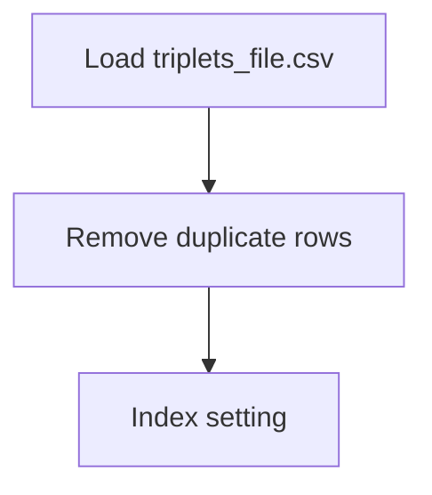

# Million Songs Dataset - Recommendation Engine

## 1. Project Overview

This project implements a **Exploratory Data Analysis** pipeline for **Million Songs Dataset - Recommendation Engine**.

| Property | Value |
|----------|-------|
| **ML Task** | Exploratory Data Analysis |
| **Dataset Status** | BLOCKED RAR |

## 2. Dataset

**Data sources detected in code:**

- `triplets_file.csv`
- `song_data.csv`

> ⚠️ **Dataset not available locally.** Has RAR archives (song_data.rar, triplets_file.rar) but cannot auto-extract without unrar

## 3. Pipeline Overview

### Original Notebook Pipeline

**Preprocessing:**
- Remove duplicate rows
- Index setting

## 4. ML Workflow



## 5. Notebook Summary

| Metric | Value |
|--------|-------|
| Total cells | 26 |
| Code cells | 20 |
| Markdown cells | 6 |

## 6. Model Details

No model training in this project.

## 7. Project Structure

```
Million Songs Dataset - Recommendation Engine/
├── Million Songs Data - Recommendation Engine.ipynb
├── Recommenders.py
├── song_data.rar
├── triplets_file.rar
└── README.md
```

## 8. Setup & Installation

`pip install -r requirements.txt` from the workspace root.

**Key dependencies:**

- `numpy`
- `pandas`

## 9. How to Run

Open and run the notebook(s) sequentially:

```bash
jupyter notebook
```

- Open `Million Songs Data - Recommendation Engine.ipynb` and run all cells

Run the Python script(s):

```bash
python "Recommenders.py"
```

## 10. Testing

Automated tests are available in `tests/test_p055_*.py`:

```bash
python -m pytest tests/test_p055_*.py -v
```

Tests validate data loading and library imports.

## 11. Limitations

- Dataset is not available locally — notebook cannot run without manual data setup
- No model training — this is an analysis/tutorial notebook only
