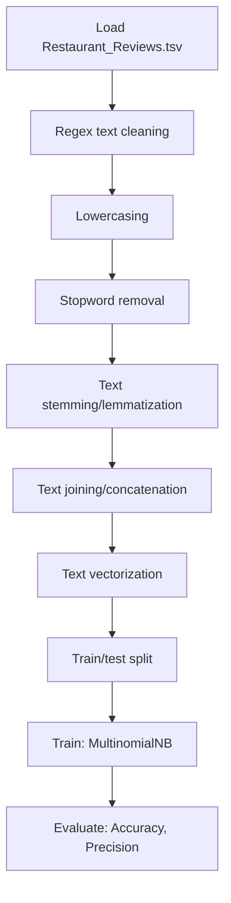

# Sentiment Analysis - Restaurant Reviews

## 1. Project Overview

This project implements a **NLP / Binary Classification** pipeline for **Sentiment Analysis - Restaurant Reviews**.

| Property | Value |
|----------|-------|
| **ML Task** | NLP / Binary Classification |
| **Dataset Status** | OK LOCAL |

## 2. Dataset

**Data sources detected in code:**

- `Restaurant_Reviews.tsv`

**Files in project directory:**

- `Restaurant_Reviews.tsv`

**Standardized data path:** `data/sentiment_analysis_-_restaurant_reviews/`

## 3. Pipeline Overview

### Original Notebook Pipeline

**Preprocessing:**
- Regex text cleaning
- Lowercasing
- Stopword removal
- Text stemming/lemmatization
- Text joining/concatenation
- Text vectorization (CountVectorizer)
- Train/test split

**Models trained:**
- MultinomialNB

**Evaluation metrics:**
- Accuracy
- Precision
- Recall
- Confusion Matrix

## 4. ML Workflow



## 5. Notebook Summary

| Metric | Value |
|--------|-------|
| Total cells | 26 |
| Code cells | 23 |
| Markdown cells | 3 |
| Original models | MultinomialNB |

## 6. Model Details

### Original Models

- `MultinomialNB`

### Evaluation Metrics

- Accuracy
- Precision
- Recall
- Confusion Matrix

## 7. Project Structure

```
Restaurant Reviews/
├── Sentiment Analysis of Restaurant Reviews.ipynb
├── Restaurant_Reviews.tsv
└── README.md
```

## 8. Setup & Installation

`pip install -r requirements.txt` from the workspace root.

**Key dependencies:**

- `matplotlib`
- `nltk`
- `numpy`
- `pandas`
- `scikit-learn`
- `seaborn`

## 9. How to Run

Open and run the notebook(s) sequentially:

```bash
jupyter notebook
```

- Open `Sentiment Analysis of Restaurant Reviews.ipynb` and run all cells

## 10. Testing

Automated tests are available in `tests/test_p085_*.py`:

```bash
python -m pytest tests/test_p085_*.py -v
```

Tests validate data loading and model instantiation.

## 11. Limitations

- Hardcoded file paths detected — may need adjustment
- Contains Google Colab artifacts
