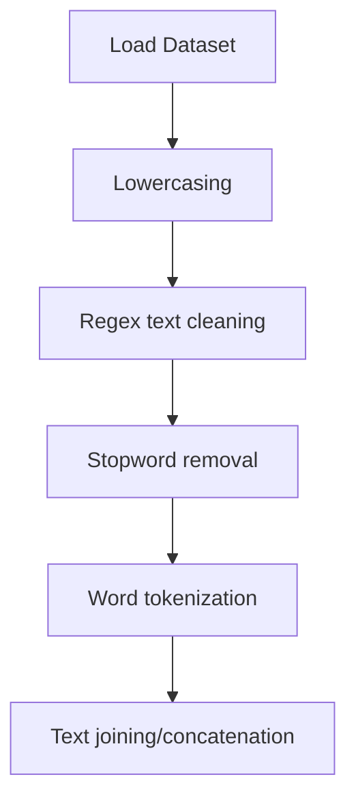

# Text Summarization using Word Frequency - NLP

## 1. Project Overview

This project implements a **NLP / Text Analysis** pipeline for **Text Summarization using Word Frequency - NLP**.

| Property | Value |
|----------|-------|
| **ML Task** | NLP / Text Analysis |
| **Dataset Status** | OK BUILTIN |

## 2. Dataset

## 3. Pipeline Overview

### Original Notebook Pipeline

**Preprocessing:**
- Lowercasing
- Regex text cleaning
- Stopword removal
- Word tokenization (NLTK)
- Text joining/concatenation

## 4. ML Workflow



## 5. Notebook Summary

| Metric | Value |
|--------|-------|
| Total cells | 17 |
| Code cells | 12 |
| Markdown cells | 5 |

## 6. Model Details

No model training in this project.

## 7. Project Structure

```
Text Summarization using Word Frequency - NLP/
├── Text Summarization using Word Frequency - NLP.ipynb
└── README.md
```

## 8. Setup & Installation

`pip install -r requirements.txt` from the workspace root.

**Key dependencies:**

- `nltk`

## 9. How to Run

Open and run the notebook(s) sequentially:

```bash
jupyter notebook
```

- Open `Text Summarization using Word Frequency - NLP.ipynb` and run all cells

## 10. Testing

Automated tests are available in `tests/test_p091_*.py`:

```bash
python -m pytest tests/test_p091_*.py -v
```

Tests validate data loading and library imports.

## 11. Limitations

- No model training — this is an analysis/tutorial notebook only
