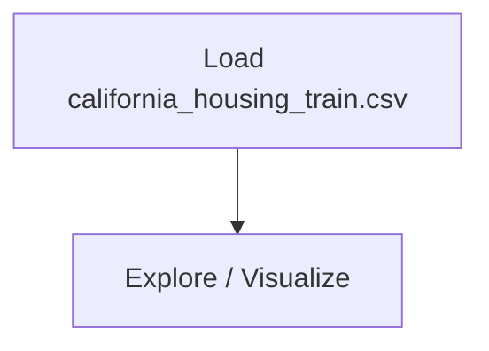

# California Housing

## 1. Project Overview

This project implements a **Exploratory Data Analysis** pipeline for **California Housing**. The target variable is `median_house_value`.

| Property | Value |
|----------|-------|
| **ML Task** | Exploratory Data Analysis |
| **Target Variable** | `median_house_value` |
| **Dataset Status** | OK LOCAL |

## 2. Dataset

**Data sources detected in code:**

- `california_housing_train.csv`

**Files in project directory:**

- `california_housing_train.csv`

**Standardized data path:** `data/california_housing/`

## 3. Pipeline Overview

The original notebook primarily contains data loading and exploratory data analysis.

## 4. ML Workflow



## 5. Notebook Summary

| Metric | Value |
|--------|-------|
| Total cells | 20 |
| Code cells | 12 |
| Markdown cells | 8 |

## 6. Model Details

No model training in this project.

## 7. Project Structure

```
California Housing/
├── a_features.ipynb
├── california_housing_train.csv
└── README.md
```

## 8. Setup & Installation

`pip install -r requirements.txt` from the workspace root.

**Key dependencies:**

- `numpy`
- `pandas`
- `tensorflow`

## 9. How to Run

Open and run the notebook(s) sequentially:

```bash
jupyter notebook
```

- Open `a_features.ipynb` and run all cells

## 10. Testing

Automated tests are available in `tests/test_p100_*.py`:

```bash
python -m pytest tests/test_p100_*.py -v
```

Tests validate data loading and library imports.

## 11. Limitations

- No model training — this is an analysis/tutorial notebook only
