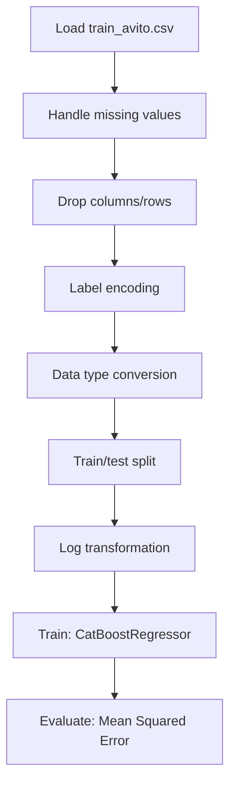

# Ad Demand Forecast Avito

## 1. Project Overview

This project implements a **Time Series Forecasting** pipeline for **Ad Demand Forecast Avito**. The target variable is `deal_probability`.

| Property | Value |
|----------|-------|
| **ML Task** | Time Series Forecasting |
| **Target Variable** | `deal_probability` |
| **Dataset Status** | OK LOCAL |

## 2. Dataset

**Data sources detected in code:**

- `train_avito.csv`
- `train_avito.csv`

**Files in project directory:**

- `param_1.csv`
- `param_2.csv`
- `param_3.csv`
- `parent_product_categories.csv`
- `product_categories.csv`
- `random_slice.csv`
- `random_slice_desc_translation.csv`
- `random_slice_title_translation.csv`
- `russian_city_names_in_english.csv`
- `russian_region_names_in_english.csv`

**Standardized data path:** `data/ad_demand_forecast_avito/`

## 3. Pipeline Overview

### Original Notebook Pipeline

**Preprocessing:**
- Handle missing values (fillna)
- Drop columns/rows
- Label encoding (LabelEncoder)
- Data type conversion
- Train/test split
- Log transformation

**Models trained:**
- CatBoostRegressor

**Evaluation metrics:**
- Mean Squared Error

## 4. ML Workflow



## 5. Notebook Summary

| Metric | Value |
|--------|-------|
| Total cells | 47 |
| Code cells | 36 |
| Markdown cells | 11 |
| Original models | CatBoostRegressor |

## 6. Model Details

### Original Models

- `CatBoostRegressor`

### Evaluation Metrics

- Mean Squared Error

## 7. Project Structure

```
Ad Demand Forecast Avito/
├── Ad Demand Forecast Avito.ipynb
├── param_1.csv
├── param_2.csv
├── param_3.csv
├── parent_product_categories.csv
├── product_categories.csv
├── random_slice.csv
├── random_slice_desc_translation.csv
├── random_slice_title_translation.csv
├── russian_city_names_in_english.csv
├── russian_region_names_in_english.csv
└── README.md
```

## 8. Setup & Installation

`pip install -r requirements.txt` from the workspace root.

**Key dependencies:**

- `catboost`
- `lightgbm`
- `matplotlib`
- `numpy`
- `pandas`
- `scikit-learn`
- `scipy`
- `seaborn`

## 9. How to Run

Open and run the notebook(s) sequentially:

```bash
jupyter notebook
```

- Open `Ad Demand Forecast Avito.ipynb` and run all cells

## 10. Testing

Automated tests are available in `tests/test_p101_*.py`:

```bash
python -m pytest tests/test_p101_*.py -v
```

Tests validate data loading and model instantiation.

## 11. Limitations

No significant limitations detected.
