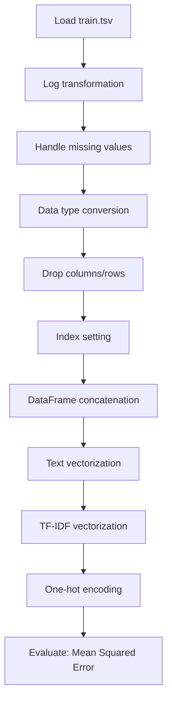

# Mercari Price Suggestion Lightgbm

## 1. Project Overview

This project implements a **Regression** pipeline for **Mercari Price Suggestion Lightgbm**.

| Property | Value |
|----------|-------|
| **ML Task** | Regression |
| **Dataset Status** | BLOCKED MISSING |

## 2. Dataset

**Data sources detected in code:**

- `train.tsv`
- `train.tsv`

> ⚠️ **Dataset not available locally.** train.tsv (Kaggle: mercari-price-suggestion-challenge)

## 3. Pipeline Overview

### Original Notebook Pipeline

**Preprocessing:**
- Log transformation
- Handle missing values (fillna)
- Data type conversion
- Drop columns/rows
- Index setting
- DataFrame concatenation
- Text vectorization (CountVectorizer)
- TF-IDF vectorization
- One-hot encoding (pd.get_dummies)

**Evaluation metrics:**
- Mean Squared Error

## 4. ML Workflow



## 5. Notebook Summary

| Metric | Value |
|--------|-------|
| Total cells | 70 |
| Code cells | 42 |
| Markdown cells | 28 |

## 6. Model Details

### Evaluation Metrics

- Mean Squared Error

No model training in this project.

## 7. Project Structure

```
Mercari Price Suggestion Lightgbm/
├── Mercari Price Suggestion Lightgbm.ipynb
└── README.md
```

## 8. Setup & Installation

`pip install -r requirements.txt` from the workspace root.

**Key dependencies:**

- `lightgbm`
- `matplotlib`
- `numpy`
- `pandas`
- `scikit-learn`
- `scipy`
- `seaborn`

## 9. How to Run

Open and run the notebook(s) sequentially:

```bash
jupyter notebook
```

- Open `Mercari Price Suggestion Lightgbm.ipynb` and run all cells

## 10. Testing

Automated tests are available in `tests/test_p109_*.py`:

```bash
python -m pytest tests/test_p109_*.py -v
```

Tests validate data loading and library imports.

## 11. Limitations

- Dataset is not available locally — notebook cannot run without manual data setup
- No model training — this is an analysis/tutorial notebook only
