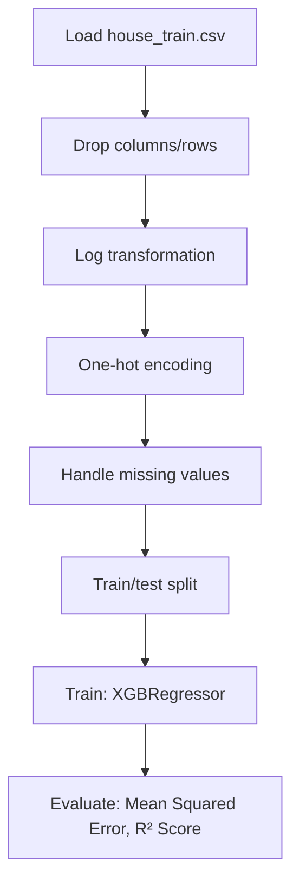

# Modeling House Price with Regularized Linear Model _ Xgboos

## 1. Project Overview

This project implements a **Regression** pipeline for **Modeling House Price with Regularized Linear Model _ Xgboos**.

| Property | Value |
|----------|-------|
| **ML Task** | Regression |
| **Dataset Status** | OK LOCAL |

## 2. Dataset

**Data sources detected in code:**

- `house_train.csv`

**Files in project directory:**

- `train.csv`

**Standardized data path:** `data/modeling_house_price_with_regularized_linear_model___xgboos/`

## 3. Pipeline Overview

### Original Notebook Pipeline

**Preprocessing:**
- Drop columns/rows
- Log transformation
- One-hot encoding (pd.get_dummies)
- Handle missing values (fillna)
- Train/test split

**Models trained:**
- XGBRegressor

**Evaluation metrics:**
- Mean Squared Error
- R² Score

## 4. ML Workflow



## 5. Notebook Summary

| Metric | Value |
|--------|-------|
| Total cells | 39 |
| Code cells | 28 |
| Markdown cells | 11 |
| Original models | XGBRegressor |

**⚠️ Deprecated APIs detected:**

- `sns.distplot()` is deprecated — use `sns.displot()` or `sns.histplot()`

## 6. Model Details

### Original Models

- `XGBRegressor`

### Evaluation Metrics

- Mean Squared Error
- R² Score

## 7. Project Structure

```
Modeling House Price with Regularized Linear Model _ Xgboos/
├── Modeling House Price with Regularized Linear Model _ Xgboost.ipynb
├── train.csv
└── README.md
```

## 8. Setup & Installation

`pip install -r requirements.txt` from the workspace root.

**Key dependencies:**

- `matplotlib`
- `numpy`
- `pandas`
- `scikit-learn`
- `scipy`
- `seaborn`
- `xgboost`

## 9. How to Run

Open and run the notebook(s) sequentially:

```bash
jupyter notebook
```

- Open `Modeling House Price with Regularized Linear Model _ Xgboost.ipynb` and run all cells

## 10. Testing

Automated tests are available in `tests/test_p110_*.py`:

```bash
python -m pytest tests/test_p110_*.py -v
```

Tests validate data loading and model instantiation.

## 11. Limitations

- `sns.distplot()` is deprecated — use `sns.displot()` or `sns.histplot()`
