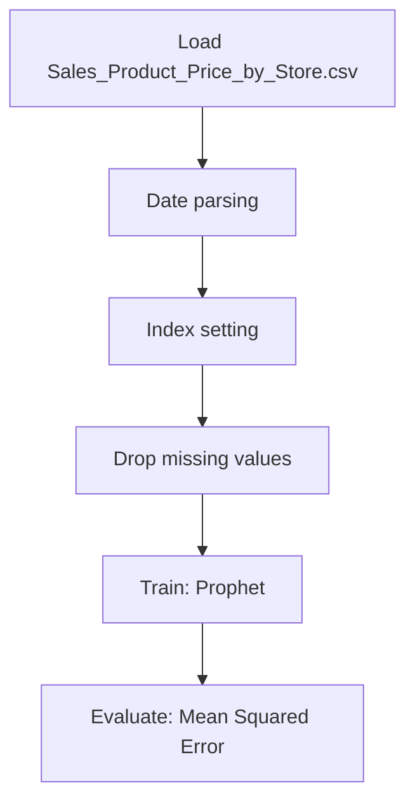

# Promotional Time Series

## 1. Project Overview

This project implements a **Time Series Forecasting** pipeline for **Promotional Time Series**.

| Property | Value |
|----------|-------|
| **ML Task** | Time Series Forecasting |
| **Dataset Status** | OK LOCAL |

## 2. Dataset

**Data sources detected in code:**

- `Sales_Product_Price_by_Store.csv`

**Files in project directory:**

- `Sales_Product_Price_by_Store.csv`

**Standardized data path:** `data/promotional_time_series/`

## 3. Pipeline Overview

### Original Notebook Pipeline

**Preprocessing:**
- Date parsing
- Index setting
- Drop missing values (dropna)

**Models trained:**
- Prophet

**Evaluation metrics:**
- Mean Squared Error

## 4. ML Workflow



## 5. Notebook Summary

| Metric | Value |
|--------|-------|
| Total cells | 64 |
| Code cells | 44 |
| Markdown cells | 20 |
| Original models | Prophet |

## 6. Model Details

### Original Models

- `Prophet`

### Evaluation Metrics

- Mean Squared Error

## 7. Project Structure

```
Promotional Time Series/
├── Promotional Time Series .ipynb
├── Sales_Product_Price_by_Store.csv
└── README.md
```

## 8. Setup & Installation

`pip install -r requirements.txt` from the workspace root.

**Key dependencies:**

- `plotly`
- `scikit-learn`
- `statsmodels`

## 9. How to Run

Open and run the notebook(s) sequentially:

```bash
jupyter notebook
```

- Open `Promotional Time Series .ipynb` and run all cells

## 10. Testing

Automated tests are available in `tests/test_p115_*.py`:

```bash
python -m pytest tests/test_p115_*.py -v
```

Tests validate data loading and model instantiation.

## 11. Limitations

- No train/test split detected in code
