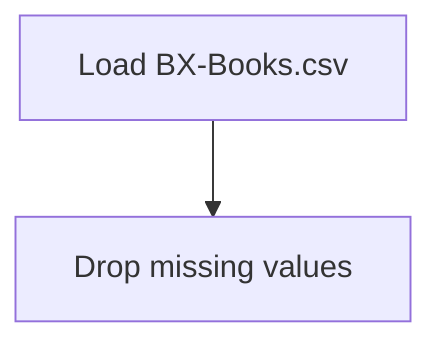

# Recommender Systems - The Fundamentals

## 1. Project Overview

This project implements a **Exploratory Data Analysis** pipeline for **Recommender Systems - The Fundamentals**.

| Property | Value |
|----------|-------|
| **ML Task** | Exploratory Data Analysis |
| **Dataset Status** | BLOCKED LINK ONLY |

## 2. Dataset

**Data sources detected in code:**

- `BX-Books.csv`
- `BX-Users.csv`
- `BX-Book-Ratings.csv`

> ⚠️ **Dataset not available locally.** Link-only but no downloadable URL identified

## 3. Pipeline Overview

### Original Notebook Pipeline

**Preprocessing:**
- Drop missing values (dropna)

## 4. ML Workflow



## 5. Notebook Summary

| Metric | Value |
|--------|-------|
| Total cells | 34 |
| Code cells | 18 |
| Markdown cells | 16 |

## 6. Model Details

No model training in this project.

## 7. Project Structure

```
Recommender Systems - The Fundamentals/
├── Recommender Systems - The Fundamentals.ipynb
├── BX-Books.csv.zip
├── BX-Users.csv.zip
└── README.md
```

## 8. Setup & Installation

`pip install -r requirements.txt` from the workspace root.

**Key dependencies:**

- `matplotlib`
- `numpy`
- `pandas`

## 9. How to Run

Open and run the notebook(s) sequentially:

```bash
jupyter notebook
```

- Open `Recommender Systems - The Fundamentals.ipynb` and run all cells

## 10. Testing

Automated tests are available in `tests/test_p117_*.py`:

```bash
python -m pytest tests/test_p117_*.py -v
```

Tests validate data loading and library imports.

## 11. Limitations

- Dataset is not available locally — notebook cannot run without manual data setup
- No model training — this is an analysis/tutorial notebook only
