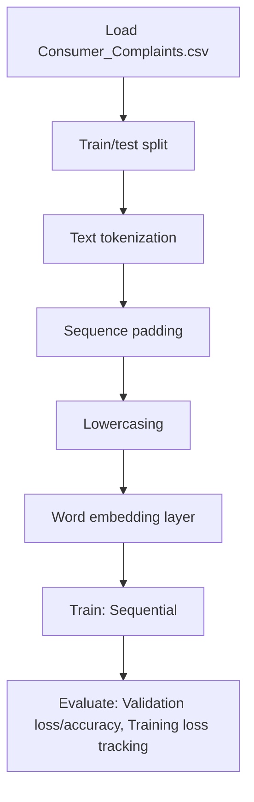

# Text Classification keras_consumer_complaints

## 1. Project Overview

This project implements a **Classification** pipeline for **Text Classification keras_consumer_complaints**.

| Property | Value |
|----------|-------|
| **ML Task** | Classification |
| **Dataset Status** | BLOCKED MISSING |

## 2. Dataset

**Data sources detected in code:**

- `Consumer_Complaints.csv`

> ⚠️ **Dataset not available locally.** Consumer_Complaints.csv + glove.6B.50d.txt.gz

## 3. Pipeline Overview

### Original Notebook Pipeline

**Preprocessing:**
- Train/test split
- Text tokenization (Keras)
- Sequence padding
- Lowercasing
- Word embedding layer

**Models trained:**
- Sequential

**Evaluation metrics:**
- Validation loss/accuracy
- Training loss tracking

## 4. ML Workflow



## 5. Notebook Summary

| Metric | Value |
|--------|-------|
| Total cells | 19 |
| Code cells | 19 |
| Markdown cells | 0 |
| Original models | Sequential |

**⚠️ Deprecated APIs detected:**

- `sklearn.cross_validation` removed — use `sklearn.model_selection`

## 6. Model Details

### Original Models

- `Sequential`

**Neural network architecture:**

```
  LSTM(32)
  Dense(32)
  Flatten
  Embedding
```

### Evaluation Metrics

- Validation loss/accuracy
- Training loss tracking

## 7. Project Structure

```
Text Classification keras_consumer_complaints/
├── Text Classification keras_consumer_complaints.ipynb
└── README.md
```

## 8. Setup & Installation

`pip install -r requirements.txt` from the workspace root.

**Key dependencies:**

- `keras`
- `matplotlib`
- `numpy`
- `pandas`
- `scikit-learn`

## 9. How to Run

Open and run the notebook(s) sequentially:

```bash
jupyter notebook
```

- Open `Text Classification keras_consumer_complaints.ipynb` and run all cells

## 10. Testing

Automated tests are available in `tests/test_p125_*.py`:

```bash
python -m pytest tests/test_p125_*.py -v
```

Tests validate data loading and model instantiation.

## 11. Limitations

- Dataset is not available locally — notebook cannot run without manual data setup
- `sklearn.cross_validation` removed — use `sklearn.model_selection`
