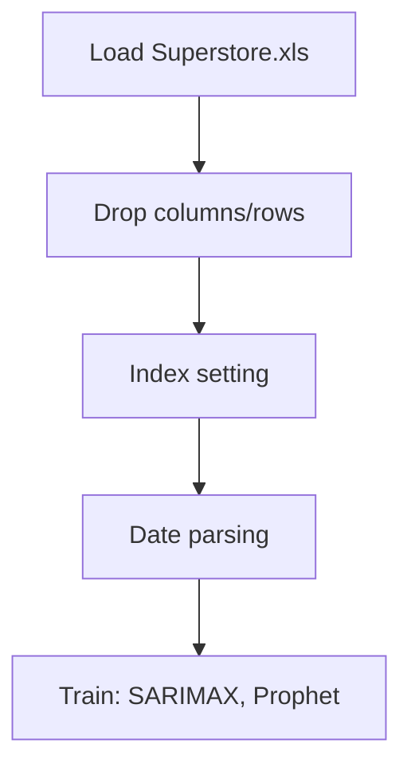

# Time Series Forecastings

## 1. Project Overview

This project implements a **Time Series Forecasting** pipeline for **Time Series Forecastings**.

| Property | Value |
|----------|-------|
| **ML Task** | Time Series Forecasting |
| **Dataset Status** | OK LOCAL |

## 2. Dataset

**Data sources detected in code:**

- `Superstore.xls`

**Files in project directory:**

- `Sample - Superstore.xls`

**Standardized data path:** `data/time_series_forecastings/`

## 3. Pipeline Overview

### Original Notebook Pipeline

**Preprocessing:**
- Drop columns/rows
- Index setting
- Date parsing

**Models trained:**
- SARIMAX
- Prophet

## 4. ML Workflow



## 5. Notebook Summary

| Metric | Value |
|--------|-------|
| Total cells | 66 |
| Code cells | 39 |
| Markdown cells | 27 |
| Original models | SARIMAX, Prophet |

## 6. Model Details

### Original Models

- `SARIMAX`
- `Prophet`

## 7. Project Structure

```
Time Series Forecastings/
├── Time Series Forecastings.ipynb
├── Sample - Superstore.xls
└── README.md
```

## 8. Setup & Installation

`pip install -r requirements.txt` from the workspace root.

**Key dependencies:**

- `matplotlib`
- `numpy`
- `pandas`
- `statsmodels`

## 9. How to Run

Open and run the notebook(s) sequentially:

```bash
jupyter notebook
```

- Open `Time Series Forecastings.ipynb` and run all cells

## 10. Testing

Automated tests are available in `tests/test_p126_*.py`:

```bash
python -m pytest tests/test_p126_*.py -v
```

Tests validate data loading and model instantiation.

## 11. Limitations

- No train/test split detected in code
- No evaluation metrics found in original code
