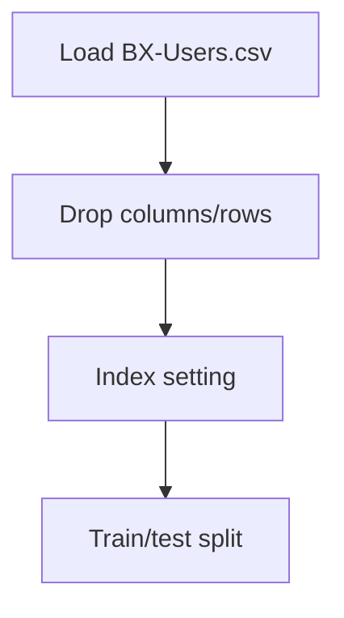

# Building Recommender system with surpise

## 1. Project Overview

This project implements a **Exploratory Data Analysis** pipeline for **Building Recommender system with surpise**.

| Property | Value |
|----------|-------|
| **ML Task** | Exploratory Data Analysis |
| **Dataset Status** | OK LOCAL |

## 2. Dataset

**Data sources detected in code:**

- `BX-Users.csv`
- `BX-Book-Ratings.csv`

**Files in project directory:**

- `BX-Users.csv`

**Standardized data path:** `data/building_recommender_system_with_surpise/`

## 3. Pipeline Overview

### Original Notebook Pipeline

**Preprocessing:**
- Drop columns/rows
- Index setting
- Train/test split

## 4. ML Workflow



## 5. Notebook Summary

| Metric | Value |
|--------|-------|
| Total cells | 46 |
| Code cells | 30 |
| Markdown cells | 16 |

## 6. Model Details

No model training in this project.

## 7. Project Structure

```
Building Recommender system with surpise/
├── Building Recommender System with Surprise.ipynb
├── BX-Users.csv
└── README.md
```

## 8. Setup & Installation

`pip install -r requirements.txt` from the workspace root.

**Key dependencies:**

- `matplotlib`
- `pandas`
- `plotly`

## 9. How to Run

Open and run the notebook(s) sequentially:

```bash
jupyter notebook
```

- Open `Building Recommender System with Surprise.ipynb` and run all cells

## 10. Testing

Automated tests are available in `tests/test_p133_*.py`:

```bash
python -m pytest tests/test_p133_*.py -v
```

Tests validate data loading and library imports.

## 11. Limitations

- No model training — this is an analysis/tutorial notebook only
