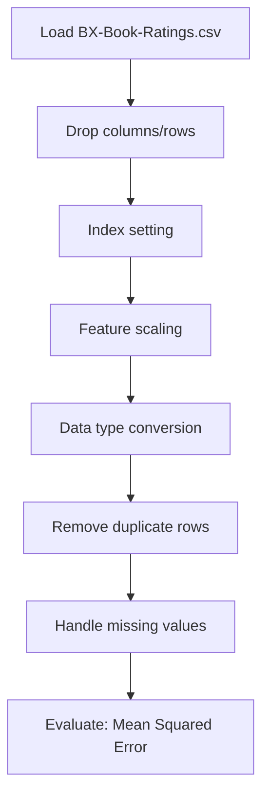

# Collaborative Filtering Model with TensorFlow

## 1. Project Overview

This project implements a **Exploratory Data Analysis** pipeline for **Collaborative Filtering Model with TensorFlow**.

| Property | Value |
|----------|-------|
| **ML Task** | Exploratory Data Analysis |
| **Dataset Status** | OK LOCAL |

## 2. Dataset

**Data sources detected in code:**

- `BX-Book-Ratings.csv`
- `BX-Users.csv`
- `BX-Books.csv`

**Files in project directory:**

- `BX-Book-Ratings.csv`
- `BX-Books.csv`
- `BX-Users.csv`

**Standardized data path:** `data/collaborative_filtering_model_with_tensorflow/`

## 3. Pipeline Overview

### Original Notebook Pipeline

**Preprocessing:**
- Drop columns/rows
- Index setting
- Feature scaling (MinMaxScaler)
- Data type conversion
- Remove duplicate rows
- Handle missing values (fillna)

**Evaluation metrics:**
- Mean Squared Error

## 4. ML Workflow



## 5. Notebook Summary

| Metric | Value |
|--------|-------|
| Total cells | 36 |
| Code cells | 26 |
| Markdown cells | 10 |

## 6. Model Details

### Evaluation Metrics

- Mean Squared Error

No model training in this project.

## 7. Project Structure

```
Collaborative Filtering Model with TensorFlow/
├── Collaborative Filtering Model with TensorFlow.ipynb
├── BX-Book-Ratings.csv
├── BX-Books.csv
├── BX-Users.csv
└── README.md
```

## 8. Setup & Installation

`pip install -r requirements.txt` from the workspace root.

**Key dependencies:**

- `numpy`
- `pandas`
- `scikit-learn`
- `tensorflow`

## 9. How to Run

Open and run the notebook(s) sequentially:

```bash
jupyter notebook
```

- Open `Collaborative Filtering Model with TensorFlow.ipynb` and run all cells

## 10. Testing

Automated tests are available in `tests/test_p136_*.py`:

```bash
python -m pytest tests/test_p136_*.py -v
```

Tests validate data loading and library imports.

## 11. Limitations

- No model training — this is an analysis/tutorial notebook only
