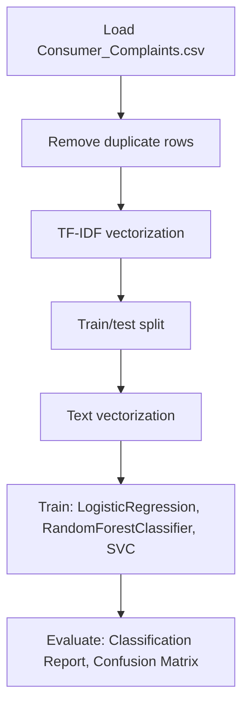

# Consumer_complaints

## 1. Project Overview

This project implements a **Classification** pipeline for **Consumer_complaints**.

| Property | Value |
|----------|-------|
| **ML Task** | Classification |
| **Dataset Status** | BLOCKED MISSING |

## 2. Dataset

**Data sources detected in code:**

- `Consumer_Complaints.csv`

> ⚠️ **Dataset not available locally.** Consumer_Complaints.csv

## 3. Pipeline Overview

### Original Notebook Pipeline

**Preprocessing:**
- Remove duplicate rows
- TF-IDF vectorization
- Train/test split
- Text vectorization (CountVectorizer)

**Models trained:**
- LogisticRegression
- RandomForestClassifier
- SVC
- MultinomialNB

**Evaluation metrics:**
- Classification Report
- Confusion Matrix
- Cross-Validation Score

## 4. ML Workflow



## 5. Notebook Summary

| Metric | Value |
|--------|-------|
| Total cells | 26 |
| Code cells | 26 |
| Markdown cells | 0 |
| Original models | LogisticRegression, RandomForestClassifier, SVC, MultinomialNB |

## 6. Model Details

### Original Models

- `LogisticRegression`
- `RandomForestClassifier`
- `SVC`
- `MultinomialNB`

### Evaluation Metrics

- Classification Report
- Confusion Matrix
- Cross-Validation Score

## 7. Project Structure

```
Consumer_complaints/
├── Consumer_complaints.ipynb
└── README.md
```

## 8. Setup & Installation

`pip install -r requirements.txt` from the workspace root.

**Key dependencies:**

- `matplotlib`
- `numpy`
- `pandas`
- `scikit-learn`
- `seaborn`

## 9. How to Run

Open and run the notebook(s) sequentially:

```bash
jupyter notebook
```

- Open `Consumer_complaints.ipynb` and run all cells

## 10. Testing

Automated tests are available in `tests/test_p137_*.py`:

```bash
python -m pytest tests/test_p137_*.py -v
```

Tests validate data loading and model instantiation.

## 11. Limitations

- Dataset is not available locally — notebook cannot run without manual data setup
