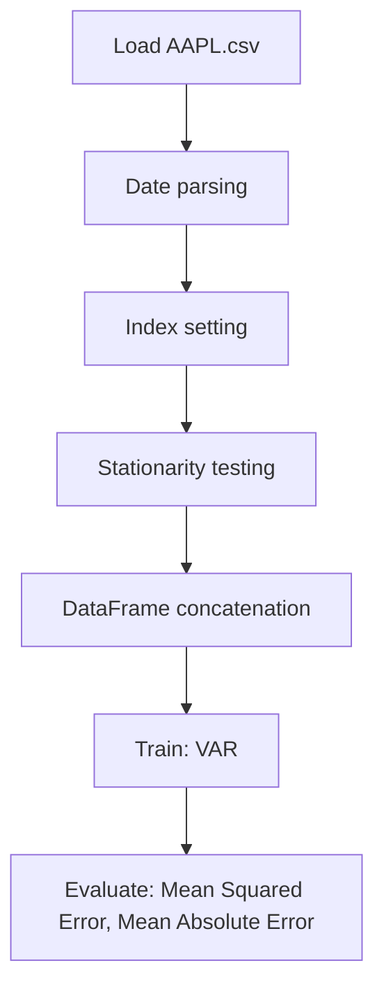

# Granger Causality Test

## 1. Project Overview

This project implements a **Exploratory Data Analysis** pipeline for **Granger Causality Test**.

| Property | Value |
|----------|-------|
| **ML Task** | Exploratory Data Analysis |
| **Dataset Status** | OK LOCAL |

## 2. Dataset

**Data sources detected in code:**

- `AAPL.csv`
- `WMT.csv`
- `TSLA.csv`

**Files in project directory:**

- `AAPL.csv`
- `TSLA.csv`
- `WMT.csv`

**Standardized data path:** `data/granger_causality_test/`

## 3. Pipeline Overview

### Original Notebook Pipeline

**Preprocessing:**
- Date parsing
- Index setting
- Stationarity testing (ADF)
- DataFrame concatenation

**Models trained:**
- VAR

**Evaluation metrics:**
- Mean Squared Error
- Mean Absolute Error

## 4. ML Workflow



## 5. Notebook Summary

| Metric | Value |
|--------|-------|
| Total cells | 60 |
| Code cells | 38 |
| Markdown cells | 22 |
| Original models | VAR |

## 6. Model Details

### Original Models

- `VAR`

### Evaluation Metrics

- Mean Squared Error
- Mean Absolute Error

## 7. Project Structure

```
Granger Causality Test/
├── Granger Causality Test.ipynb
├── AAPL.csv
├── TSLA.csv
├── WMT.csv
└── README.md
```

## 8. Setup & Installation

`pip install -r requirements.txt` from the workspace root.

**Key dependencies:**

- `plotly`
- `scikit-learn`
- `statsmodels`

## 9. How to Run

Open and run the notebook(s) sequentially:

```bash
jupyter notebook
```

- Open `Granger Causality Test.ipynb` and run all cells

## 10. Testing

Automated tests are available in `tests/test_p141_*.py`:

```bash
python -m pytest tests/test_p141_*.py -v
```

Tests validate data loading and model instantiation.

## 11. Limitations

No significant limitations detected.
