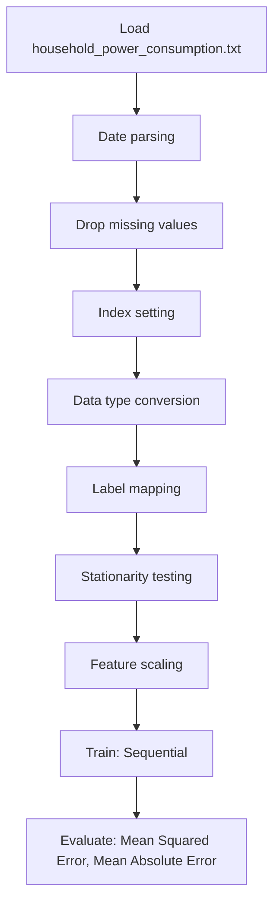

# LSTM Time Series Power Consumption

## 1. Project Overview

This project implements a **Time Series Forecasting** pipeline for **LSTM Time Series Power Consumption**.

| Property | Value |
|----------|-------|
| **ML Task** | Time Series Forecasting |
| **Dataset Status** | BLOCKED MISSING |

## 2. Dataset

**Data sources detected in code:**

- `household_power_consumption.txt`

> ⚠️ **Dataset not available locally.** household_power_consumption.txt (UCI ML Repo)

## 3. Pipeline Overview

### Original Notebook Pipeline

**Preprocessing:**
- Date parsing
- Drop missing values (dropna)
- Index setting
- Data type conversion
- Label mapping (function)
- Stationarity testing (ADF)
- Feature scaling (MinMaxScaler)

**Models trained:**
- Sequential

**Evaluation metrics:**
- Mean Squared Error
- Mean Absolute Error
- Validation loss/accuracy
- Training loss tracking

## 4. ML Workflow



## 5. Notebook Summary

| Metric | Value |
|--------|-------|
| Total cells | 53 |
| Code cells | 28 |
| Markdown cells | 25 |
| Original models | Sequential |

**⚠️ Deprecated APIs detected:**

- `sns.distplot()` is deprecated — use `sns.displot()` or `sns.histplot()`

## 6. Model Details

### Original Models

- `Sequential`

**Neural network architecture:**

```
  LSTM(100)
  Dense(1)
  Dropout(0.2)
```

### Evaluation Metrics

- Mean Squared Error
- Mean Absolute Error
- Validation loss/accuracy
- Training loss tracking

## 7. Project Structure

```
LSTM Time Series Power Consumption/
├── LSTM Time Series Power Consumption.ipynb
└── README.md
```

## 8. Setup & Installation

`pip install -r requirements.txt` from the workspace root.

**Key dependencies:**

- `keras`
- `matplotlib`
- `numpy`
- `pandas`
- `scikit-learn`
- `scipy`
- `seaborn`
- `statsmodels`

## 9. How to Run

Open and run the notebook(s) sequentially:

```bash
jupyter notebook
```

- Open `LSTM Time Series Power Consumption.ipynb` and run all cells

## 10. Testing

Automated tests are available in `tests/test_p144_*.py`:

```bash
python -m pytest tests/test_p144_*.py -v
```

Tests validate data loading and model instantiation.

## 11. Limitations

- Dataset is not available locally — notebook cannot run without manual data setup
- `sns.distplot()` is deprecated — use `sns.displot()` or `sns.histplot()`
