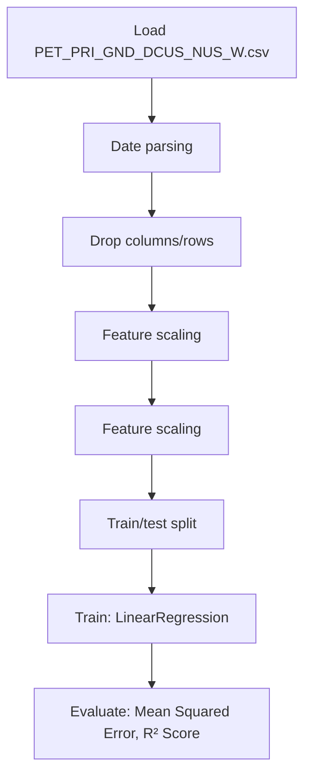

# U.S. Gasoline and Diesel Retail Prices 1995-2021

## 1. Project Overview

This project implements a **Regression** pipeline for **U.S. Gasoline and Diesel Retail Prices 1995-2021**.

| Property | Value |
|----------|-------|
| **ML Task** | Regression |
| **Dataset Status** | BLOCKED LINK ONLY |

## 2. Dataset

**Data sources detected in code:**

- `PET_PRI_GND_DCUS_NUS_W.csv`

> ⚠️ **Dataset not available locally.** Link-only but no downloadable URL identified

## 3. Pipeline Overview

### Original Notebook Pipeline

**Preprocessing:**
- Date parsing
- Drop columns/rows
- Feature scaling (RobustScaler)
- Feature scaling (MinMaxScaler)
- Train/test split

**Models trained:**
- LinearRegression

**Evaluation metrics:**
- Mean Squared Error
- R² Score
- Model Score

## 4. ML Workflow



## 5. Notebook Summary

| Metric | Value |
|--------|-------|
| Total cells | 67 |
| Code cells | 41 |
| Markdown cells | 26 |
| Original models | LinearRegression |

**⚠️ Deprecated APIs detected:**

- `sns.distplot()` is deprecated — use `sns.displot()` or `sns.histplot()`

## 6. Model Details

### Original Models

- `LinearRegression`

### Evaluation Metrics

- Mean Squared Error
- R² Score
- Model Score

## 7. Project Structure

```
Machine Learning Projects 148 -U.S. Gasoline and Diesel Retail Prices 1995-2021/
├── gasoline-price-predictions-97-acc-0-overfitting.ipynb
├── Data.zip
└── README.md
```

## 8. Setup & Installation

`pip install -r requirements.txt` from the workspace root.

**Key dependencies:**

- `catboost`
- `lightgbm`
- `matplotlib`
- `numpy`
- `pandas`
- `scikit-learn`
- `seaborn`
- `xgboost`

## 9. How to Run

Open and run the notebook(s) sequentially:

```bash
jupyter notebook
```

- Open `gasoline-price-predictions-97-acc-0-overfitting.ipynb` and run all cells

## 10. Testing

Automated tests are available in `tests/test_p148_*.py`:

```bash
python -m pytest tests/test_p148_*.py -v
```

Tests validate data loading and model instantiation.

## 11. Limitations

- Dataset is not available locally — notebook cannot run without manual data setup
- `sns.distplot()` is deprecated — use `sns.displot()` or `sns.histplot()`
- Hardcoded file paths detected — may need adjustment
