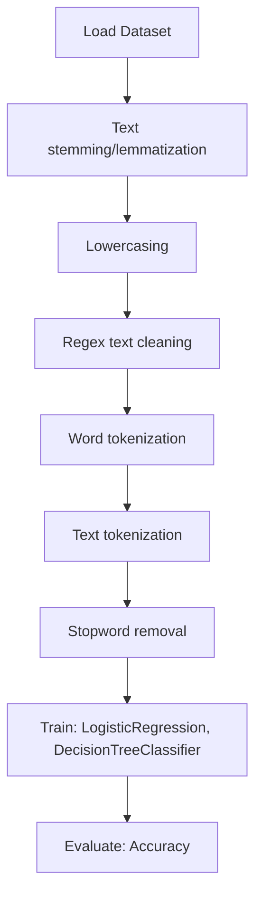

# 3-Way Sentiment Analysis for Tweets

## 1. Project Overview

This project implements a **NLP / Binary Classification** pipeline for **3-Way Sentiment Analysis for Tweets**.

| Property | Value |
|----------|-------|
| **ML Task** | NLP / Binary Classification |
| **Dataset Status** | OK LOCAL |

## 2. Dataset

**Standardized data path:** `data/3-way_sentiment_analysis_for_tweets/`

## 3. Pipeline Overview

### Original Notebook Pipeline

**Preprocessing:**
- Text stemming/lemmatization
- Lowercasing
- Regex text cleaning
- Word tokenization (NLTK)
- Text tokenization (Keras)
- Stopword removal

**Models trained:**
- LogisticRegression
- DecisionTreeClassifier

**Evaluation metrics:**
- Accuracy

## 4. ML Workflow



## 5. Notebook Summary

| Metric | Value |
|--------|-------|
| Total cells | 42 |
| Code cells | 18 |
| Markdown cells | 24 |
| Original models | LogisticRegression, DecisionTreeClassifier |

**⚠️ Deprecated APIs detected:**

- `sklearn.grid_search` removed — use `sklearn.model_selection`

## 6. Model Details

### Original Models

- `LogisticRegression`
- `DecisionTreeClassifier`

### Evaluation Metrics

- Accuracy

## 7. Project Structure

```
3-Way Sentiment Analysis for Tweets/
├── 3-Way Sentiment Analysis for Tweets.ipynb
├── data
└── README.md
```

## 8. Setup & Installation

`pip install -r requirements.txt` from the workspace root.

**Key dependencies:**

- `gensim`
- `nltk`
- `scikit-learn`

## 9. How to Run

Open and run the notebook(s) sequentially:

```bash
jupyter notebook
```

- Open `3-Way Sentiment Analysis for Tweets.ipynb` and run all cells

## 10. Testing

Automated tests are available in `tests/test_p070_*.py`:

```bash
python -m pytest tests/test_p070_*.py -v
```

Tests validate data loading and model instantiation.

## 11. Limitations

- `sklearn.grid_search` removed — use `sklearn.model_selection`
- No train/test split detected in code
