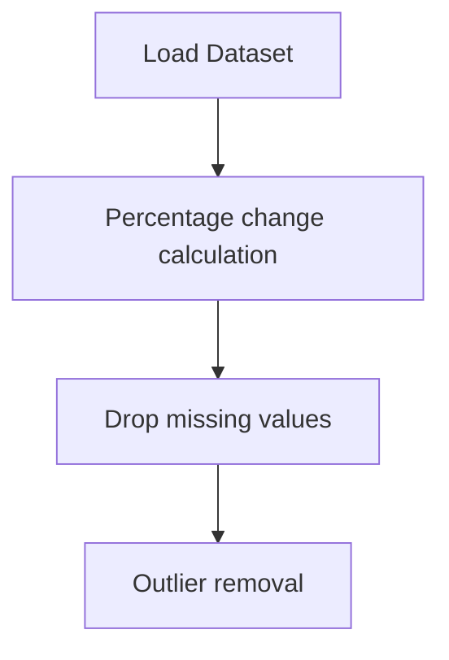

# Stock Market Analysis for Tech Stocks

## 1. Project Overview

This project implements a **Exploratory Data Analysis** pipeline for **Stock Market Analysis for Tech Stocks**.

| Property | Value |
|----------|-------|
| **ML Task** | Exploratory Data Analysis |
| **Dataset Status** | OK LOCAL |

## 2. Dataset

**Standardized data path:** `data/stock_market_analysis_for_tech_stocks/`

## 3. Pipeline Overview

### Original Notebook Pipeline

**Preprocessing:**
- Percentage change calculation
- Drop missing values (dropna)
- Outlier removal (IQR/quantile)

## 4. ML Workflow



## 5. Notebook Summary

| Metric | Value |
|--------|-------|
| Total cells | 62 |
| Code cells | 35 |
| Markdown cells | 27 |

**⚠️ Deprecated APIs detected:**

- `sns.distplot()` is deprecated — use `sns.displot()` or `sns.histplot()`

## 6. Model Details

No model training in this project.

## 7. Project Structure

```
Stock Market Analysis for Tech Stocks/
├── Stock Market Analysis for Tech Stocks.ipynb
├── data
└── README.md
```

## 8. Setup & Installation

`pip install -r requirements.txt` from the workspace root.

**Key dependencies:**

- `matplotlib`
- `numpy`
- `pandas`
- `seaborn`

## 9. How to Run

Open and run the notebook(s) sequentially:

```bash
jupyter notebook
```

- Open `Stock Market Analysis for Tech Stocks.ipynb` and run all cells

## 10. Testing

Automated tests are available in `tests/test_p075_*.py`:

```bash
python -m pytest tests/test_p075_*.py -v
```

Tests validate data loading and library imports.

## 11. Limitations

- `sns.distplot()` is deprecated — use `sns.displot()` or `sns.histplot()`
- No model training — this is an analysis/tutorial notebook only
