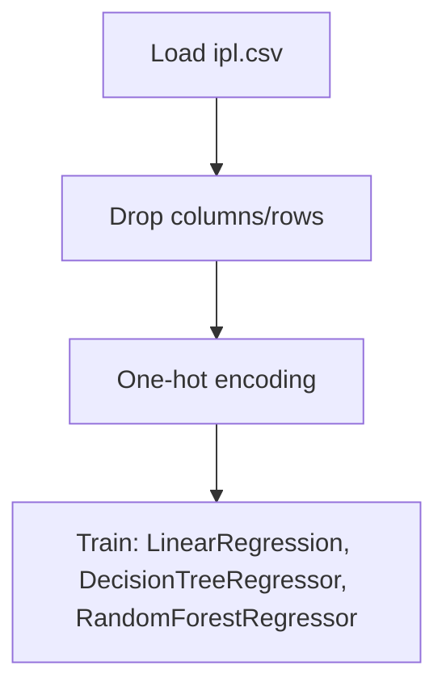

# Regression - First Innings Score Prediction - IPL

## 1. Project Overview

This project implements a **Regression** pipeline for **Regression - First Innings Score Prediction - IPL**.

| Property | Value |
|----------|-------|
| **ML Task** | Regression |
| **Dataset Status** | OK LOCAL |

## 2. Dataset

**Data sources detected in code:**

- `ipl.csv`

**Standardized data path:** `data/regression_-_first_innings_score_prediction_-_ipl/`

## 3. Pipeline Overview

### Original Notebook Pipeline

**Preprocessing:**
- Drop columns/rows
- One-hot encoding (pd.get_dummies)

**Models trained:**
- LinearRegression
- DecisionTreeRegressor
- RandomForestRegressor

## 4. ML Workflow



## 5. Notebook Summary

| Metric | Value |
|--------|-------|
| Total cells | 61 |
| Code cells | 42 |
| Markdown cells | 19 |
| Original models | LinearRegression, DecisionTreeRegressor, RandomForestRegressor |

## 6. Model Details

### Original Models

- `LinearRegression`
- `DecisionTreeRegressor`
- `RandomForestRegressor`

## 7. Project Structure

```
First Innings Score Prediction - IPL/
├── First Innings Score Prediction - IPL.ipynb
├── dataset
└── README.md
```

## 8. Setup & Installation

`pip install -r requirements.txt` from the workspace root.

**Key dependencies:**

- `matplotlib`
- `numpy`
- `pandas`
- `scikit-learn`
- `seaborn`

## 9. How to Run

Open and run the notebook(s) sequentially:

```bash
jupyter notebook
```

- Open `First Innings Score Prediction - IPL.ipynb` and run all cells

## 10. Testing

Automated tests are available in `tests/test_p083_*.py`:

```bash
python -m pytest tests/test_p083_*.py -v
```

Tests validate data loading and model instantiation.

## 11. Limitations

- No evaluation metrics found in original code
