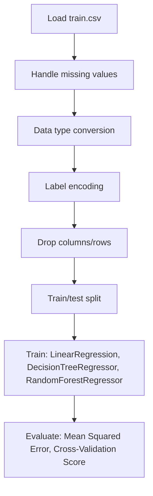

# Regression - Black Friday Sales Prediction Analysis

## 1. Project Overview

This project implements a **Regression** pipeline for **Regression - Black Friday Sales Prediction Analysis**. The target variable is `Purchase`.

| Property | Value |
|----------|-------|
| **ML Task** | Regression |
| **Target Variable** | `Purchase` |
| **Dataset Status** | OK LOCAL |

## 2. Dataset

**Data sources detected in code:**

- `train.csv`

**Files in project directory:**

- `train.csv`

**Standardized data path:** `data/regression_-_black_friday_sales_prediction_analysis/`

## 3. Pipeline Overview

### Original Notebook Pipeline

**Preprocessing:**
- Handle missing values (fillna)
- Data type conversion
- Label encoding (LabelEncoder)
- Drop columns/rows
- Train/test split

**Models trained:**
- LinearRegression
- DecisionTreeRegressor
- RandomForestRegressor

**Evaluation metrics:**
- Mean Squared Error
- Cross-Validation Score

## 4. ML Workflow



## 5. Notebook Summary

| Metric | Value |
|--------|-------|
| Total cells | 43 |
| Code cells | 35 |
| Markdown cells | 8 |
| Original models | LinearRegression, DecisionTreeRegressor, RandomForestRegressor |

**⚠️ Deprecated APIs detected:**

- `sns.distplot()` is deprecated — use `sns.displot()` or `sns.histplot()`

## 6. Model Details

### Original Models

- `LinearRegression`
- `DecisionTreeRegressor`
- `RandomForestRegressor`

### Evaluation Metrics

- Mean Squared Error
- Cross-Validation Score

## 7. Project Structure

```
Regression - Black Friday Sales Prediction Analysis/
├── Black Friday Sales Prediction Analysis - Regression.ipynb
├── train.csv
└── README.md
```

## 8. Setup & Installation

`pip install -r requirements.txt` from the workspace root.

**Key dependencies:**

- `matplotlib`
- `numpy`
- `pandas`
- `scikit-learn`
- `seaborn`

## 9. How to Run

Open and run the notebook(s) sequentially:

```bash
jupyter notebook
```

- Open `Black Friday Sales Prediction Analysis - Regression.ipynb` and run all cells

## 10. Testing

Automated tests are available in `tests/test_p095_*.py`:

```bash
python -m pytest tests/test_p095_*.py -v
```

Tests validate data loading and model instantiation.

## 11. Limitations

- `sns.distplot()` is deprecated — use `sns.displot()` or `sns.histplot()`
