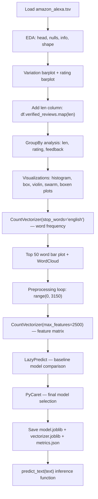

# Amazon Alexa Review Sentiment Analysis

> **Repository**: [https://github.com/pypi-ahmad/Natural-Language-Processing-Projects](https://github.com/pypi-ahmad/Natural-Language-Processing-Projects)

## 1. Project Overview

This project performs sentiment analysis on Amazon Alexa product reviews. The notebook loads a TSV dataset, performs extensive EDA with seaborn/matplotlib visualizations, preprocesses review text using Porter Stemmer and stopword removal, vectorizes with CountVectorizer, and then runs LazyPredict and PyCaret for automated model comparison and selection.

## 2. Dataset

| Item | Value |
|------|-------|
| **File** | `amazon_alexa.tsv` |
| **Data path** | `data/NLP Projects 27 - Amazon Alexa Review Sentiment Analysis/amazon_alexa.tsv` |
| **Format** | Tab-delimited |
| **Columns** | `rating`, `date`, `variation`, `verified_reviews`, `feedback` |

Loaded via:

```python
df = pd.read_csv(str(DATA_DIR / 'amazon_alexa.tsv'), delimiter='\t')
```

## 3. Pipeline Overview

| Step | Cell(s) | Description |
|------|---------|-------------|
| 1 | 1 | Resolve `DATA_DIR` using `_find_data_dir()` |
| 2 | 2 | Import libraries (numpy, pandas, seaborn, matplotlib, re, nltk, wordcloud, sklearn) |
| 3 | 3 | Load `amazon_alexa.tsv` |
| 4 | 4–6 | EDA: `head()`, `isnull().sum()`, `info()` |
| 5 | 7 | Top 5 variation value counts + barplot |
| 6 | 8 | `df.shape` |
| 7 | 9 | Add `len` column: `df['len'] = df['verified_reviews'].map(len)` |
| 8 | 10–12 | GroupBy analysis: by `len`, by `rating`, by `feedback` |
| 9 | 13 | Rating value counts + barplot |
| 10 | 14 | Histogram of review lengths |
| 11 | 15–18 | Inspect specific reviews by length (1, 150, 50, 25) |
| 12 | 19 | Box plot: rating vs len |
| 13 | 20 | Violin plot: feedback vs rating |
| 14 | 21 | Swarm plot: variation vs len |
| 15 | 22 | Boxen plot: variation vs rating |
| 16 | 23 | First `CountVectorizer(stop_words='english')` — word frequency analysis |
| 17 | 24 | Bar plot of top 50 frequent words |
| 18 | 25 | WordCloud visualization |
| 19 | 26 | Text preprocessing loop: regex, lowercase, split, PorterStemmer, stopword removal |
| 20 | 27 | Second `CountVectorizer(max_features=2500)` — feature matrix for modeling |
| 21 | 29 | LazyPredict baseline comparison |
| 22 | 30 | PyCaret final model selection |
| 23 | 32 | Save artifacts: `model.joblib`, `vectorizer.joblib`, `metrics.json` |
| 24 | 33 | Define `predict_text(text)` inference function |
| 25 | 34 | Consistency checks and summary |

## 4. Workflow Diagram



## 5. Core Logic Breakdown

### First CountVectorizer (word frequency analysis)

```python
count_vector = CountVectorizer(stop_words='english')
ws = count_vector.fit_transform(df.verified_reviews)
```

Used to build a word frequency DataFrame `freq` with columns `['word', 'freq']` for visualization. This vectorizer is not used for modeling.

### Text preprocessing loop

```python
for i in range(0, 3150):
    r = re.sub('[^a-zA-Z]', ' ', df['verified_reviews'][i])
    r = r.lower()
    r = r.split()
    ps = PorterStemmer()
    sw = stopwords.words('english')
    sw.remove('not')
    r = [ps.stem(word) for word in r if not word in set(sw)]
    r = ' '.join(r)
    c.append(r)
```

Steps per review: remove non-alpha characters → lowercase → split → Porter stem → remove stopwords (keeping "not") → rejoin.

### Second CountVectorizer (model features)

```python
count_vector = CountVectorizer(max_features=2500)
X = count_vector.fit_transform(c).toarray()
y = df.iloc[:, 4].values
```

Target variable `y` is taken from column index 4 (`feedback`).

### `predict_text(text)`

Transforms a single text input through the second `count_vector` and runs prediction via the final PyCaret model.

## 6. Model / Output Details

| Item | Value |
|------|-------|
| **Vectorizer** | `CountVectorizer(max_features=2500)` |
| **Model selection** | LazyPredict (baseline) + PyCaret (final) |
| **Artifacts directory** | `artifacts/alexa_reviews/` |
| **Saved files** | `model.joblib`, `vectorizer.joblib`, `metrics.json` |
| **Project name** | `alexa_reviews` |

## 7. Project Structure

```
NLP Projects 27 - Amazon Alexa Review Sentiment Analysis/
├── alexa-amazon-reviews(1).ipynb   # Main notebook
├── amazon_alexa.tsv                # Dataset (also in data/)
├── test_alexa_reviews.py           # Test file (122 lines)
└── README.md
```

## 8. Setup & Installation

```bash
pip install numpy pandas seaborn matplotlib nltk wordcloud scikit-learn lazypredict pycaret joblib
```

NLTK data required:

```python
import nltk
nltk.download('stopwords')
```

## 9. How to Run

1. Ensure `amazon_alexa.tsv` is in the `data/NLP Projects 27 - Amazon Alexa Review Sentiment Analysis/` directory.
2. Open `alexa-amazon-reviews(1).ipynb` in Jupyter/VS Code.
3. Run all cells.

## 10. Testing

| File | Lines | Classes |
|------|-------|---------|
| `test_alexa_reviews.py` | 122 | `TestDataLoading`, `TestPreprocessing`, `TestModel`, `TestPrediction` |

```bash
pytest "NLP Projects 27 - Amazon Alexa Review Sentiment Analysis/test_alexa_reviews.py" -v
```

## 11. Limitations

- **Hardcoded `range(0, 3150)`**: The preprocessing loop iterates over exactly 3150 rows. If the dataset has more or fewer rows, reviews are silently skipped or an `IndexError` occurs.
- **Duplicate CountVectorizer variable name**: Both the word-frequency vectorizer and the model-feature vectorizer are assigned to `count_vector`, overwriting the first. The saved artifact (`vectorizer.joblib`) only contains the second one.
- **PorterStemmer re-instantiated every iteration**: `ps = PorterStemmer()` and `sw = stopwords.words('english')` are created inside the loop on every iteration instead of once outside.
- **Unused imports**: `MinMaxScaler`, `GridSearchCV`, `confusion_matrix` are imported but never used.
- **Target via column index**: `y = df.iloc[:, 4].values` relies on column position rather than name, which is fragile.
