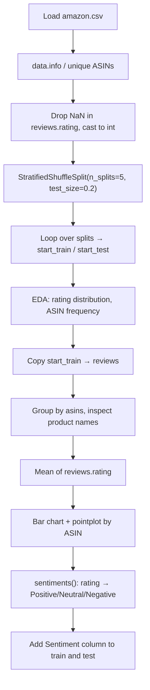

# Amazon Product Review Sentiment Analysis

> **Repository**: [https://github.com/pypi-ahmad/Natural-Language-Processing-Projects](https://github.com/pypi-ahmad/Natural-Language-Processing-Projects)

## 1. Project Overview

Explores Amazon product reviews and maps star ratings to sentiment labels (Positive, Neutral, Negative). The notebook performs EDA with seaborn/matplotlib, uses `StratifiedShuffleSplit` for train/test splitting, and derives a `Sentiment` column from `reviews.rating`. No ML model is trained or saved.

## 2. Dataset

| Item | Value |
|------|-------|
| File | `amazon.csv` |
| Path | `data/NLP Projecct 20.Amazon Sentiment Analysis/amazon.csv` |
| Key columns | `name`, `asins`, `reviews.rating`, `reviews.text` |
| Derived column | `Sentiment` — mapped from `reviews.rating` via `sentiments()` function |

## 3. Pipeline Overview

| Step | Cell(s) | Description |
|------|---------|-------------|
| 1 | 1 | Data-directory resolution (`_find_data_dir()`) |
| 2 | 2–3 | Import pandas/numpy/seaborn, load `amazon.csv` |
| 3 | 4 | `data.info()` |
| 4 | 5–6 | Inspect unique `asins`, print count of unique ASINs |
| 5 | 7 | Import matplotlib, set `np.random.seed(7)` |
| 6 | 8 | Drop NaN in `reviews.rating`, cast to int; `StratifiedShuffleSplit(n_splits=5, test_size=0.2)` |
| 7 | 9 | Loop over splits → `start_train`, `start_test` (last split is kept) |
| 8 | 10–11 | Print train/test lengths; print test rating distribution |
| 9 | 12–13 | Copy `start_train` to `reviews`; print `reviews.info()` |
| 10 | 14–16 | Group by `asins` to find unique `name`s; inspect ASIN `B00L9EPT8O,B01E6AO69U` |
| 11 | 17 | Print `reviews["reviews.rating"].mean()` |
| 12 | 18 | Bar chart of ASIN frequency + pointplot of rating by ASIN |
| 13 | 19 | Define `sentiments(rating)` — maps 4–5→Positive, 3→Neutral, 1–2→Negative |
| 14 | 20 | Apply `sentiments` to both `start_train` and `start_test` → new `Sentiment` column |
| 15 | 21 | Print first 20 sentiment labels |
| 16 | 22 | Empty cell |

## 4. Workflow Diagram



## 5. Core Logic Breakdown

### Stratified split (Cells 8–9)
```python
split = StratifiedShuffleSplit(n_splits=5, test_size=0.2)
for train_index, test_index in split.split(dataAfter, dataAfter["reviews.rating"]):
    start_train = dataAfter.reindex(train_index)
    start_test = dataAfter.reindex(test_index)
```
Loops over all 5 splits but only keeps the last iteration's `start_train` / `start_test`.

### Sentiment mapping (Cell 19)
```python
def sentiments(rating):
    if (rating == 5) or (rating == 4):
        return "Positive"
    elif rating == 3:
        return "Neutral"
    elif (rating == 2) or (rating == 1):
        return "Negative"
```

### Applying sentiment (Cell 20)
```python
start_train["Sentiment"] = start_train["reviews.rating"].apply(sentiments)
start_test["Sentiment"] = start_test["reviews.rating"].apply(sentiments)
```

### EDA visualisation (Cell 18)
```python
asins_count_ix = reviews["asins"].value_counts().index
plt.subplots(2, 1, figsize=(16, 12))
plt.subplot(2, 1, 1)
reviews["asins"].value_counts().plot(kind="bar", title="ASIN Frequency", color="orange")
plt.subplot(2, 1, 2)
sns.pointplot(x="asins", y="reviews.rating", order=asins_count_ix, data=reviews)
plt.xticks(rotation=90)
plt.show()
```

## 6. Model / Output Details

No model is trained in this notebook. The notebook is EDA-only: it loads data, performs stratified sampling, visualises rating distributions, and maps ratings to sentiment labels. There are no artifacts saved.

## 7. Project Structure

```
NLP Projecct 20.Amazon Sentiment Analysis/
├── AmazonCentiment_Analysis.ipynb   # Main notebook (typo: "Centiment")
├── test_amazon_sentiment.py         # Test suite (95 lines)
├── amazon.csv                       # Dataset (local copy)
└── README.md
data/NLP Projecct 20.Amazon Sentiment Analysis/
└── amazon.csv
```

## 8. Setup & Installation

```
pip install pandas numpy scikit-learn seaborn matplotlib
```

## 9. How to Run

1. Open `AmazonCentiment_Analysis.ipynb` in Jupyter.
2. Run all cells sequentially.
3. The notebook produces visualisations and prints the derived `Sentiment` column. No model is saved.

## 10. Testing

| File | Classes | Line count |
|------|---------|------------|
| `test_amazon_sentiment.py` | `TestDataLoading`, `TestPreprocessing`, `TestModel`, `TestPrediction` | 95 |

Run:
```
pytest "NLP Projecct 20.Amazon Sentiment Analysis/test_amazon_sentiment.py" -v
```

## 11. Limitations

- No ML model is trained or saved — the notebook ends after labelling sentiments from star ratings.
- `StratifiedShuffleSplit(n_splits=5)` loops over all 5 splits but only the last split's `start_train` / `start_test` are kept; the first 4 splits are discarded.
- `dataAfter.reindex(train_index)` uses `reindex` instead of `iloc`/`loc`, which may introduce NaN rows if indices don't match the DataFrame's index.
- The `sentiments()` function returns `None` for any rating outside 1–5 (no `else` clause).
- Cell 22 is empty.
- The notebook uses `np.random.seed(7)` but `StratifiedShuffleSplit` does not accept this global seed — it has its own `random_state` parameter, which is not set.
- No text processing is applied to `reviews.text` — the review text column is present in the data but never used.
