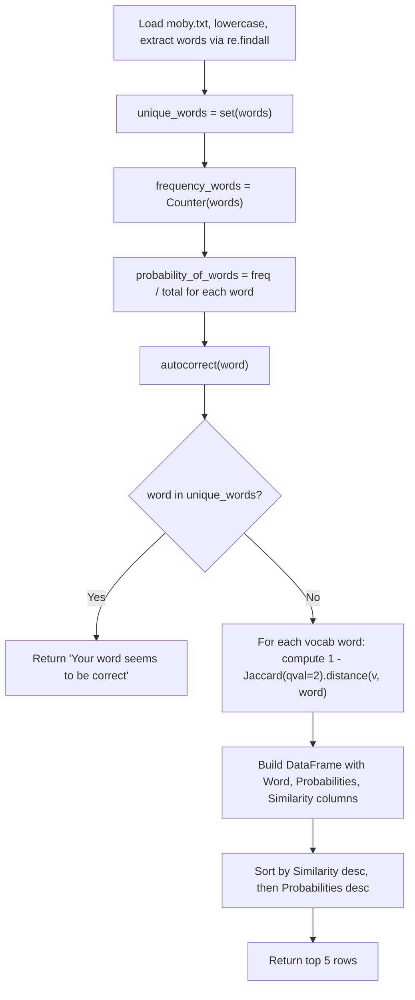

# Autocorrect with Python

> **Repository**: [https://github.com/pypi-ahmad/Natural-Language-Processing-Projects](https://github.com/pypi-ahmad/Natural-Language-Processing-Projects)

## 1. Project Overview

This project implements a spelling autocorrect function using Jaccard similarity on character bigrams. It loads a text corpus (`moby.txt`), builds a word frequency distribution, computes word probabilities, and for a given misspelled word returns the top 5 most similar words ranked by similarity and probability.

## 2. Dataset

- **File:** `moby.txt` (located at `data/NLP Projecct 6.Autocorrect/moby.txt`; also copied in the project directory)
- Plain text file used as the vocabulary corpus
- Words are extracted via regex `\w+` after lowercasing

## 3. Pipeline Overview

1. Set up data directory path via `_find_data_dir()` helper
2. Install `textdistance` library (`!pip install textdistance`)
3. Import `pandas`, `numpy`, `textdistance`, `re`
4. Load `moby.txt`, lowercase all text, extract all words via `re.findall('\w+', files)`
5. Build `unique_words` set from the word list
6. Count word frequencies using `Counter(words)` from `collections`
7. Compute `probability_of_words`: each word's frequency divided by total word count
8. Define `autocorrect(word)` function
9. Test with `autocorrect('howeveror')`

## 4. Workflow Diagram



## 5. Core Logic Breakdown

### Word loading and preprocessing
```python
with open(str(DATA_DIR / 'moby.txt'), 'r') as tmp:
    files = tmp.read()
    files = files.lower()
    words = re.findall('\w+', files)
```

### Frequency and probability computation
```python
unique_words = set(words)
frequency_words = Counter(words)
probability_of_words = {}
number_of_total_words = sum(frequency_words.values())
for word in frequency_words.keys():
    probability_of_words[word] = frequency_words[word] / number_of_total_words
```

### `autocorrect(word)`
- **Input:** a single string
- Lowercases the input word
- If `word in unique_words`, returns the string `'Your word seems to be correct'`
- Otherwise, computes Jaccard similarity for every word in `frequency_words`:
  ```python
  similar.append(1 - (textdistance.Jaccard(qval=2).distance(v, word)))
  ```
  This uses character-level bigrams (`qval=2`) to compute Jaccard distance, then converts to similarity by subtracting from 1.
- Builds a `pd.DataFrame` with columns `Word`, `Probabilities`, `Similarity`
- Sorts by `Similarity` descending, then `Probabilities` descending
- **Returns:** the top 5 rows of the sorted DataFrame (via `.head()`)

### Demo call
```python
print(list(autocorrect('howeveror')["Word"]))
print(autocorrect('howeveror'))
```

## 6. Model / Output Details

No ML model. The correction is based on Jaccard similarity (character bigrams) combined with word probability as a tiebreaker. Output is a pandas DataFrame with 5 rows showing the top candidate words, their probabilities, and similarity scores.

## 7. Project Structure

```
NLP Projecct 6.Autocorrect/
├── Autocorrect .ipynb             # Main notebook (11 cells; note trailing space in filename)
├── test_autocorrect.py            # Test suite (50 lines)
├── README.md
├── moby.txt
└── __pycache__/

data/NLP Projecct 6.Autocorrect/
└── moby.txt
```

## 8. Setup & Installation

```bash
pip install pandas numpy textdistance
```

## 9. How to Run

Open `Autocorrect .ipynb` (note the trailing space in the filename) in Jupyter and run all cells sequentially. The notebook expects `data/NLP Projecct 6.Autocorrect/moby.txt` to exist relative to the workspace root.

## 10. Testing

- **Test file:** `test_autocorrect.py` (50 lines)
- **Test classes:**
  - `TestDataLoading` — checks `moby.txt` exists, is non-empty, and loads as text
  - `TestPreprocessing` — tests tokenization, lowercasing, and word frequency counting
  - `TestModel` — verifies vocabulary size (>50 unique words) and character distribution
  - `TestPrediction` — generates bigrams from the first 100 words and verifies the output

Run tests:
```bash
pytest "NLP Projecct 6.Autocorrect/test_autocorrect.py" -v
```

## 11. Limitations

- **Brute-force similarity:** `autocorrect` computes Jaccard distance against every word in the vocabulary on each call. This is $O(n)$ per query with no indexing.
- **Returns a DataFrame, not a string:** callers must extract the top word manually (e.g., `df.iloc[0]["Word"]`).
- **`numpy` is imported but never used** in the notebook.
- **Duplicate `moby.txt`:** the file exists both in the project directory and in `data/NLP Projecct 6.Autocorrect/`; only the data directory copy is loaded.
- **No handling of empty input or non-alphabetic input** in the `autocorrect` function.
- **`textdistance` installed via `!pip install`** inside the notebook, which won't work outside Jupyter.
